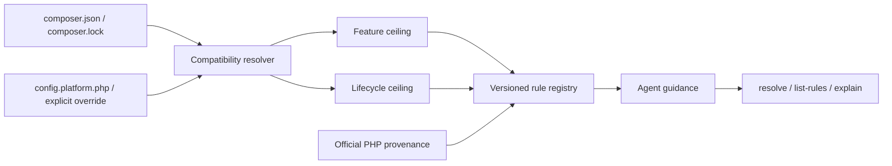

# Modern PHP Guidelines

[](https://github.com/trionnemesis/php-modern-guidelines/actions/workflows/ci.yml)
[](https://github.com/trionnemesis/php-modern-guidelines/actions/workflows/pages.yml)
[](https://www.php.net/)
[](LICENSE)
[](CHANGELOG.md)

> Give AI coding agents the project's real PHP version range, deprecated APIs, and modern alternatives before they generate code—avoiding code that runs locally but violates the project's minimum PHP version.

🌐 **[GitHub Pages overview](https://trionnemesis.github.io/php-modern-guidelines/)** ・ **繁體中文說明請見 [README.zh-TW.md](README.zh-TW.md)** ・ [Quick start](#quick-start) ・ [Current capabilities](#current-capabilities) ・ [Agent distribution](#agent-distribution) ・ [Policy flow](#policy-flow) ・ [Trust boundary](#trust-boundary) ・ [Roadmap](#roadmap) ・ [Changelog](CHANGELOG.md)

**M2 / alpha · v0.2.0.** Modern PHP Guidelines is a standalone, read-only, version-aware PHP policy and rule-query CLI. It uses Composer Semver to resolve a target project's declared PHP compatibility range, separates “how new a syntax or API may be” from “how new a deprecation or removal must be considered,” and lets AI agents query source-backed PHP rules through `resolve`, `list-rules`, `explain`, and `doctor`. It now also ships as a Claude Agent Skill, a Codex-compatible `AGENTS.md` snippet, and a CI-built, checksum-verified PHAR release asset.

## Why

AI coding agents often generate the newest PHP style based on their current runtime, while real projects commonly support several PHP minors. If a project declares `require.php: ^8.2`, seeing PHP 8.5 on the development machine does not prove that PHP 8.5-only syntax is safe to use.

This project therefore splits the Composer PHP range into two policy axes:

| Axis | Meaning | How an agent should use it |
|---|---|---|
| **Feature ceiling** | The lowest PHP minor that must remain compatible | Prevent syntax or APIs that require a higher PHP version |
| **Lifecycle ceiling** | The highest known PHP minor still allowed by the range | Surface deprecations, removals, and behavior changes from newer runtimes |

For example, `require.php: ^8.2` currently resolves to `feature_ceiling: 8.2` and `lifecycle_ceiling: 8.5`. If the constraint also allows versions after PHP 8.5, the tool reports a `coverage_gap` instead of inventing behavior for unknown future versions. See [ADR-004](docs/adr/ADR-004-two-axis-policy.md) for the complete contract.

## Current capabilities

| Slice | Implemented | Key boundary |
|---|---|---|
| Policy resolver | Resolves `require.php`, `conflict.php`, `config.platform.php`, Composer lock platform overrides, and `--php` | Reads target-project inputs without executing the target project |
| Two-axis policy | Separates `feature_ceiling` and `lifecycle_ceiling`; outputs `coverage`, `confidence`, and `warnings` | Known PHP coverage is 8.2–8.5 |
| Rule registry | Schema validation, deterministic ordering, and 16 source-backed PHP 8.2–8.5 rules | Currently covers PHP language, Core, and bundled extensions only |
| Agent query surface | `resolve`, `list-rules`, and `explain` with human and JSON output | `resolve --json` must satisfy `policy.schema.json` |
| CLI foundation | `version` and a consistent exit-code contract | Never writes to the target repository |
| Verification | PHPUnit, PHPStan level max, PHP-CS-Fixer, and PHP 8.2–8.5 CI | Verifies this repository; it does not scan the target project |
| Agent distribution | A Claude Agent Skill in `skills/php-modern-guidelines/` and a Codex-compatible `AGENTS.md` snippet in `skills/agents-md/` | Instructions only; no marketplace or plugin manifest, and no agent-runtime registration |
| PHAR distribution | A single-file archive built and smoke-tested in CI, attached to each release with a SHA-256 checksum | Built in CI only; the build tool is not a Composer dependency |
| Diagnostics | `doctor` reports what this tool found, read and loaded, in human and JSON form | Diagnoses this tool's inputs and installation; never inspects or executes the target project |

### Not implemented yet

- A project-local configuration file. `policy.schema.json` reserves `project.config`, but M2 does not read such a file.
- Laravel, Symfony, or other framework rule packs.
- PHPCompatibility, PHPStan deprecation, or Rector target-project adapters.
- Auto-fixes, target-project writes, agent marketplace manifests, or network rule fetching.

`composer.json` `conflict.php` constraints are supported. A known PHP minor is removed only when the conflict covers that minor's complete interval; a patch-level conflict such as `8.3.5` does not remove all of PHP 8.3. An explicit override—`--php`, `config.platform.php`, a Composer lock platform override, or `runtime-observed` mode—directly determines the effective version and bypasses range inference from `require.php` and `conflict.php`.

## Agent distribution

M2 makes the M1 engine consumable by coding agents that do not vendor this repository: a distributable Claude Agent Skill, a plain-Markdown `AGENTS.md` wrapper for Codex-compatible agents, and a CI-built PHAR attached to each release.

Install the skill personally:

```bash
cp -R skills/php-modern-guidelines ~/.claude/skills/
```

Or inside a consuming project:

```bash
cp -R skills/php-modern-guidelines .claude/skills/
```

For agents that read `AGENTS.md` by convention instead of a skill mechanism, paste the block from [`skills/agents-md/SNIPPET.md`](skills/agents-md/SNIPPET.md) into the consuming project's own `AGENTS.md`.

Install the released PHAR and verify it before running it:

```bash
curl -fsSL -o php-modern-guidelines.phar \
  https://github.com/trionnemesis/php-modern-guidelines/releases/latest/download/php-modern-guidelines.phar
curl -fsSL -o php-modern-guidelines.phar.sha256 \
  https://github.com/trionnemesis/php-modern-guidelines/releases/latest/download/php-modern-guidelines.phar.sha256
sha256sum -c php-modern-guidelines.phar.sha256
php php-modern-guidelines.phar version
```

The package is not published on Packagist yet, so there is no `composer require` install path; the [Quick start](#quick-start) git checkout below and this PHAR are the two supported installs.

The skill and `AGENTS.md` text are contract-tested against the real CLI, not review-tested: every command, option, exit code and rule id they name must exist in the real CLI, and every worked example is executed and compared byte-for-byte, so the instructions cannot silently drift from the tool.

The PHAR is built and smoke-tested in CI on the PHP 8.2 floor and published with a SHA-256 checksum; see [ADR-007](docs/adr/ADR-007-phar-build-and-distribution.md) for exactly what "reproducible" does and does not mean here—it is not a claim of byte-identical archives or pinned dependency versions across builds.

## Policy flow

The data flow stays small, deterministic, and read-only:



An agent should evaluate a project in this order:

1. Run `resolve` to determine the project's effective PHP policy.
2. Use `feature_ceiling` to restrict syntax and APIs that may be introduced.
3. Use `lifecycle_ceiling` to find relevant deprecations, removals, and behavior changes.
4. Filter applicable rules with `list-rules`, then use `explain` for the complete source-backed guidance.
5. Preserve coverage-gap or unknown-evidence warnings; do not fill missing PHP-version knowledge by assumption.

## Quick start

Requirements: PHP 8.2+ and Composer.

```bash
git clone https://github.com/trionnemesis/php-modern-guidelines.git
cd php-modern-guidelines
composer install
php bin/php-modern-guidelines version
```

Expected output:

```text
php-modern-guidelines 0.2.0
```

Resolve a target-project policy, list applicable rules, explain one rule, and diagnose the tool's own inputs:

```bash
php bin/php-modern-guidelines resolve --project-root=/path/to/app
php bin/php-modern-guidelines resolve --project-root=/path/to/app --json
php bin/php-modern-guidelines list-rules --project-root=/path/to/app --kind=deprecated
php bin/php-modern-guidelines explain language.property_hooks --project-root=/path/to/app
php bin/php-modern-guidelines doctor --project-root=/path/to/app
```

For a target project declaring `require.php: ^8.2`, representative `resolve` output is:

```text
PHP policy
  mode                 range-safe
  project root         <app>
  declared constraint  ^8.2
  allowed minors       8.2, 8.3, 8.4, 8.5
  feature ceiling      8.2
  lifecycle ceiling    8.5
  platform override    -
  observed runtime     -
  coverage             coverage_gap (known 8.2-8.5, open upper bound)
  confidence           declared

Sources
  composer.require.php  composer.json  ^8.2

Warnings
  coverage.open_upper_bound_bounded: The constraint "^8.2" allows PHP minors newer than 8.5, which this tool does not know. Lifecycle guidance stops at 8.5.
```

Verify this repository:

```bash
composer check
```

## CLI contract

### Exit codes

| Code | Meaning |
|---|---|
| `0` | Success |
| `1` | Unexpected internal error; a bug in the tool rather than an input problem |
| `2` | Invalid input, such as malformed or unreadable Composer JSON, an unparseable constraint, an unknown option value, or a minor outside known coverage |
| `3` | The rule id given to `explain` does not exist |
| `4` | A valid PHP constraint contains none of the PHP minors known to this tool, so policy resolution cannot proceed |
| `5` | Invalid rule data, such as a malformed rule, duplicate id, or filename/id mismatch |

For any non-zero exit from `resolve`, `list-rules` or `explain`, human-readable output is written to stderr, and in `--json` mode stdout remains byte-empty so JSON consumers never receive a partial document. `doctor` is the one documented exception: its report *is* the diagnosis, so it prints the complete report on stdout and leaves stderr empty even when it exits non-zero—except for a mistake in `doctor`'s own options, which is rejected before any check runs and still prints nothing on stdout.

### `list-rules`

`list-rules` implements the original plan's `list` query, but Symfony Console reserves `list` for its built-in command index. This project therefore uses `list-rules` and provides `rules` as an alias.

By default, it hides rules with `not_in_range` status. Use `--all` to show every rule. `--kind`, `--category`, `--priority`, and `--status` are repeatable and can be combined with `--extension` and `--minor`. `-r` and `-m` are shorthand for `--project-root` and `--mode`.

### `doctor`

`doctor` runs nine fixed, ordered, read-only checks over this tool's own inputs and installation for a target project: the running build (version, and whether it runs from a PHAR or from source), the project root, `composer.json` and `composer.lock` presence/readability/JSON validity, the declared PHP values, the resolved policy summary, both bundled schemas, and the effective rules directory and its load. Each check reports a status (`ok` / `warn` / `fail` / `skipped`), a fixed one-line summary and a fixed set of detail keys, in both human-readable and `--json` form; the JSON form carries `output_version` like `list-rules` and `explain`. It introduces no new exit code—the process exit code is whichever of `1` / `2` / `4` / `5` the first failing check would already produce today. As noted above, `doctor` prints its complete report on stdout even when it exits non-zero, because the report is the diagnosis; a mistake in `doctor`'s own options is the one case that still prints nothing.

## PHP coverage and fail-safe behavior

Known PHP minors currently span **8.2–8.5**. When a project constraint extends beyond this window, the tool does not fabricate knowledge.

| Situation | Behavior | Risk interpretation |
|---|---|---|
| Constraint allows a version below PHP 8.2 | Clamps `feature_ceiling` to the known floor of 8.2 and reports `coverage_gap` / `coverage.below_known_min` | Do not trust blindly; the real project may still support PHP 8.0 or 8.1 |
| Constraint allows a version above PHP 8.5 | Reports `coverage.open_upper_bound` and a corresponding warning | Existing generated code does not become unsafe, but later deprecations and removals are not covered |
| Explicit `--php` names an unknown minor | Fails closed with exit `4` | Never presents an unknown runtime as supported |

Coverage below the known floor deserves special attention. If the real project still supports PHP 8.0 or 8.1, this tool cannot prove that a PHP 8.2-only feature is safe. Treat this warning as a signal to extend rules and coverage, not as a warning to ignore.

## Rule model

Rules use three categories:

| Category | Scope |
|---|---|
| `language` | Parser-level syntax |
| `core` | Runtime-visible functions, classes, attributes, constants, and engine behavior |
| `extension` | Behavior requiring a named, non-default-bundled extension |

For `modern_preference` and `behavior_change`, `introduced_in` means the version in which the preferred API arrived or the behavior changed—not the version in which the legacy form was first introduced. `affected_minors` identifies the currently allowed minors for which the guidance applies; it is not a duplicate of the lifecycle-event version.

### `single-target` mode

The two-axis split is the default guarantee of `range-safe` mode. `--mode=single-target` is an explicit caller decision to narrow the range to one PHP minor. The allowed set then contains one minor, so `feature_ceiling` and `lifecycle_ceiling` are equal; the `mode.single_target_narrowed` warning discloses the narrowing.

### Rule JSON stability

The `rule` object from `explain --json` supports a deterministic round trip. Decoding it with the canonical encoder, rebuilding a `Rule`, and encoding it again preserves both the JSON value and output bytes. This guarantees data-contract stability, not PHP object identity.

## Trust boundary

The core provides verifiable guidance; it does not execute or modify a target project. Unless a future ADR explicitly changes this contract, core commands remain deterministic and read-only.

They must not:

- Execute target-project PHP.
- Load the target project's `vendor/autoload.php`.
- Run Composer scripts or plugins.
- Require network access for core resolution.
- Write to the analyzed repository.

See [ADR-006](docs/adr/ADR-006-read-only-core.md) for the complete design.

## Source provenance

Lifecycle facts for PHP language, Core, and bundled extensions require an authoritative PHP source, such as:

- An official PHP migration guide.
- A PHP RFC.
- php-src `UPGRADING` documentation.

Every rule also stores its review date. If a fact cannot be established, the rule stays absent or records uncertainty explicitly; missing facts are never filled by guesswork.

## Roadmap

| Milestone | Version | Status / focus | Handoff boundary |
|---|---|---|---|
| **M0 Foundation** | `v0.0.1` | ✅ Complete: repository contracts, CLI skeleton, schemas, CI, and static Pages | Foundation contract established |
| **M1 Core parity** | `v0.1.0` | ✅ Complete: Composer Semver resolver, two-axis policy, rule registry, `resolve` / `list-rules` / `explain`, and 16 seed rules | Framework packs and target analyzers do not enter M1 |
| **M2 Agent distribution** | `v0.2.0` | ✅ Complete: Agent Skill, Codex/AGENTS.md wrapper, CI-built PHAR attached to releases, and bounded `doctor` | Depends on the stable M1 CLI and JSON contract |
| **M3 Verification adapters** | `v0.3.0` | Next: PHPCompatibility, PHPStan deprecation, and Rector advisory integration | Advisory and read-only by default |
| **M4 Framework packs** | `v0.4.x` | Planned: separately reviewable framework-specific guidance | Must not contaminate the PHP Core rule set |

## Repository structure

| Path | Purpose |
|---|---|
| `src/` | Symfony Console application, Composer/PHP policy resolver, and rule registry/query engine |
| `resources/rules/` | 16 source-backed seed-rule JSON files, one rule per file |
| `schemas/` | Versioned rule and policy contracts |
| `docs/adr/` | Binding architecture decisions and trust boundaries |
| `tests/` | CLI, schema, and static-page verification |
| `site/` | Dependency-free GitHub Pages overview |
| `.github/workflows/` | CI, Pages, and release workflows |
| `skills/` | Distributable Agent Skill and Codex-compatible `AGENTS.md` snippet |
| `box.json.dist` | Committed PHAR build configuration; the build tool is installed in CI only |
| `tools/` | CI-only build helper scripts |

## Inspiration and attribution

Primary inspiration: [JetBrains/go-modern-guidelines](https://github.com/JetBrains/go-modern-guidelines).

Modern PHP Guidelines is an **independent implementation** inspired by its version-aware guidance model. The upstream repository uses the Apache-2.0 license ([upstream license](https://github.com/JetBrains/go-modern-guidelines/blob/main/LICENSE)); this repository does not copy upstream source files.

JetBrains and GoLand are trademarks of their respective owners. This project is not affiliated with, endorsed by, or sponsored by JetBrains.

This project also intentionally maintains a narrower product boundary than [netresearch/php-modernization-skill](https://github.com/netresearch/php-modernization-skill): its core is a version-aware PHP policy and rule-query engine, not a broad modernization orchestrator, framework convention guide, analyzer suite, or automatic fixer.

## Contributing and security

Read [CONTRIBUTING.md](CONTRIBUTING.md) before submitting changes, especially the source-provenance and milestone-boundary requirements. Report security issues according to [SECURITY.md](SECURITY.md).
