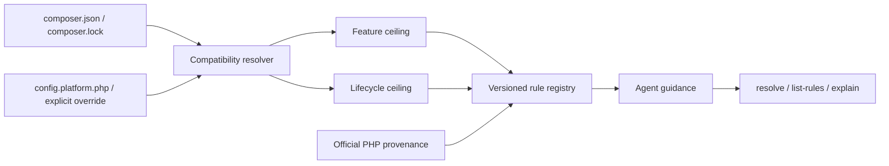

# Modern PHP Guidelines

[](https://github.com/trionnemesis/php-modern-guidelines/actions/workflows/ci.yml)
[](https://github.com/trionnemesis/php-modern-guidelines/actions/workflows/pages.yml)
[](https://www.php.net/)
[](LICENSE)
[](CHANGELOG.md)
[](docs/adr/ADR-008-external-verification-adapters.md)

> Give AI coding agents the project's real PHP version range, deprecated APIs, and modern alternatives before they generate code—avoiding code that runs locally but violates the project's minimum PHP version.

🌐 **[GitHub Pages overview](https://trionnemesis.github.io/php-modern-guidelines/)** ・ **繁體中文說明請見 [README.zh-TW.md](README.zh-TW.md)** ・ [Quick start](#quick-start) ・ [Current capabilities](#current-capabilities) ・ [Agent distribution](#agent-distribution) ・ [Policy flow](#policy-flow) ・ [Trust boundary](#trust-boundary) ・ [Roadmap](#roadmap) ・ [Changelog](CHANGELOG.md)

**Released: Rule-catalogue expansion · v0.3.6.** Modern PHP Guidelines is a standalone, read-only, version-aware PHP policy and rule-query CLI. It uses Composer Semver to resolve a target project's declared PHP compatibility range, separates “how new a syntax or API may be” from “how new a deprecation or removal must be considered,” and lets AI agents query source-backed PHP rules through `resolve`, `list-rules`, `explain`, and `doctor`. It now also ships as a Claude Agent Skill, a Codex-compatible `AGENTS.md` snippet, a CI-built, checksum-verified PHAR release asset, and an explicit, policy-aware `verify` surface backed by a real PHPCompatibility adapter.

> **Verification:** `v0.3.0` introduced the explicit, opt-in `verify <adapter> --executable=<path-or-name>` surface. Its production `phpcompatibility` adapter is a real PHPCompatibility implementation: it runs a caller-selected, already-installed PHP_CodeSniffer with the PHPCompatibility standard as an isolated child process and reports advisory evidence — never an automatic fix. A PHPStan deprecation adapter (M3-C) was deferred and a Rector dry-run adapter (M3-D) was dropped from this release line; see [Changelog](CHANGELOG.md) for why.

> **v0.3.1 hardening:** rule schema `1.1.0` stores PHPCompatibility mappings as sorted lists,
> and verification scans explicit top-level operands while omitting the exact project-root `vendor/`
> directory. The operands are recorded in the report; no unanchored PHPCS ignore pattern is used.

> **v0.3.2 rule-catalogue expansion:** eight new source-backed rules (16 → 24) covering PHP 8.2–8.5
> deprecations and features, plus twelve newly proven PHPCompatibility sniff mappings (nine of sixteen
> → sixteen of twenty-four rules mapped). No new adapter, no new PHP version coverage, and mapping
> coverage remains partial by design: `core.partially_supported_callables` ships with an empty mapping
> because PHPCompatibility reports no finding for it, and that is stated plainly rather than guessed at.

> **v0.3.3 rule-catalogue expansion:** eight more source-backed rules (24 → 32) covering PHP 8.2–8.5
> deprecations and features, plus twenty-five newly proven PHPCompatibility sniff mappings (sixteen of
> twenty-four → twenty-four of thirty-two rules mapped). No new adapter, no new PHP version coverage, and
> unlike the previous round's one unmapped rule, every one of these eight ships mapped — each was chosen
> from candidates whose PHPCompatibility mapping was already measured. Mapping coverage remains partial
> overall.

> **v0.3.4 rule-catalogue expansion:** eight more source-backed rules (32 → 40), all drawn from
> [issue #18](https://github.com/trionnemesis/php-modern-guidelines/issues/18)'s Tier B — candidates the
> CI-pinned PHPCompatibility analyzer produces no finding for at all. Unlike the previous two rounds,
> every one of these eight ships unmapped, so mapping coverage **falls** from twenty-four of thirty-two
> rules to twenty-four of forty. That is the deliberate trade this round makes, not a shortfall to spin
> away: catalogue depth is what the M3-B value gate measured as the binding constraint, and the
> highest-damage item in the whole register — the PHP 8.4 resource-to-object change, where an unchanged
> `is_resource()` guard silently takes the error branch on success — can never be mappable at all.

> **v0.3.5 rule-catalogue expansion:** eight more source-backed rules (40 → 48), all drawn from the
> [issue #18](https://github.com/trionnemesis/php-modern-guidelines/issues/18) Tier A candidates left
> unshipped after `v0.3.3` — the tier whose PHPCompatibility mapping was already measured. The dial
> reverses again: every one of these eight ships mapped, so mapping coverage **rises** from twenty-four
> of forty rules (60%) to thirty-two of forty-eight (67%). That emptied every Tier A candidate the
> analyzer-probing method had found — every one with a measured mapping became a shipped rule — leaving,
> at the time, two low-frequency Tier B candidates and two structural findings about the analyzer itself,
> in a still-partial catalogue with sixteen of forty-eight rules carrying no mapping at all. Declaring
> Tier A "exhausted" assumed analyzer-probing was a complete way to enumerate it; `v0.3.6` below found
> that assumption false.
>
> **v0.3.6 rule-catalogue expansion:** eight more source-backed rules (48 → 56). Rounds 1–4 chose
> candidates by probing PHPCompatibility, which bounded issue #18's register to whatever the analyzer
> already flagged. A [2026-09-05 re-measurement](https://github.com/trionnemesis/php-modern-guidelines/issues/18#issuecomment-5551728801)
> enumerated candidates from php-src `UPGRADING` first instead, and found **13 uncovered Core/Standard
> deprecations in 8.2–8.5, three of them mappable** — disproving the "Tier A exhausted" claim above. This
> round takes eight of those thirteen: three ship mapped (`core.stream_context_set_option_arity`,
> `core.csv_escape_parameter`, `core.socket_set_timeout`) and five ship unmapped
> (`core.http_response_header`, `core.output_in_output_handler`, `core.chr_ord_byte_range`,
> `core.directory_functions_implicit_handle`, `language.case_terminating_semicolon` — the last with no
> sniff in the pinned analyzer at all). Mapping coverage **falls** from thirty-two of forty-eight rules
> (67%) to thirty-five of fifty-six (62%), stated in the direction it moved rather than rounded away.
> These eight rules cover nine of the thirteen entries, one rule carrying both the `chr()` and the `ord()`
> entry, so four newly-found gaps — all unmappable — remain open, and twenty-one of the fifty-six
> rules now carry no mapping at all.

## Why

AI coding agents often generate the newest PHP style based on their current runtime, while real projects commonly support several PHP minors. If a project declares `require.php: ^8.2`, seeing PHP 8.5 on the development machine does not prove that PHP 8.5-only syntax is safe to use.

This project therefore splits the Composer PHP range into two policy axes:

| Axis | Meaning | How an agent should use it |
|---|---|---|
| **Feature ceiling** | The lowest PHP minor that must remain compatible | Prevent syntax or APIs that require a higher PHP version |
| **Lifecycle ceiling** | The highest known PHP minor still allowed by the range | Surface deprecations, removals, and behavior changes from newer runtimes |

For example, `require.php: ^8.2` currently resolves to `feature_ceiling: 8.2` and `lifecycle_ceiling: 8.5`. If the constraint also allows versions after PHP 8.5, the tool reports a `coverage_gap` instead of inventing behavior for unknown future versions. See [ADR-004](docs/adr/ADR-004-two-axis-policy.md) for the complete contract.

## Current capabilities

| Slice | Implemented | Key boundary |
|---|---|---|
| Policy resolver | Resolves `require.php`, `conflict.php`, `config.platform.php`, Composer lock platform overrides, and `--php` | Reads target-project inputs without executing the target project |
| Two-axis policy | Separates `feature_ceiling` and `lifecycle_ceiling`; outputs `coverage`, `confidence`, and `warnings` | Known PHP coverage is 8.2–8.5 |
| Rule registry | Schema validation, deterministic ordering, and 56 source-backed PHP 8.2–8.5 rules | Currently covers PHP language, Core, and bundled extensions only |
| Agent query surface | `resolve`, `list-rules`, and `explain` with human and JSON output | `resolve --json` must satisfy `policy.schema.json` |
| CLI foundation | `version` and a consistent exit-code contract | Never writes to the target repository |
| Repository verification | PHPUnit, PHPStan level max, PHP-CS-Fixer, and PHP 8.2–8.5 CI | Verifies this repository; it does not scan the target project |
| Verification | `verify` command with a real, policy-aware PHPCompatibility adapter: canonical JSON schema, deterministic statuses, exact policy projection, and a committed sniff-to-rule mapping | Explicit opt-in, zero-mutation, advisory evidence only; PHPStan and Rector adapters are not included |
| Agent distribution | A Claude Agent Skill in `skills/php-modern-guidelines/` and a Codex-compatible `AGENTS.md` snippet in `skills/agents-md/` | Instructions only; no marketplace or plugin manifest, and no agent-runtime registration |
| PHAR distribution | A single-file archive built and smoke-tested in CI, attached to each release with a SHA-256 checksum | Built in CI only; the build tool is not a Composer dependency |
| Diagnostics | `doctor` reports what this tool found, read and loaded, in human and JSON form | Diagnoses this tool's inputs and installation; never inspects or executes the target project |

### Not implemented yet

- A project-local configuration file. `policy.schema.json` reserves `project.config`, but M2 does not read such a file.
- Laravel, Symfony, or other framework rule packs.
- PHPStan deprecation or Rector target-project adapters. The real PHPCompatibility adapter shipped in `v0.3.0`; PHPStan (M3-C) was deferred and Rector (M3-D) was dropped from this release line — see [Changelog](CHANGELOG.md).
- Auto-fixes, target-project writes, agent marketplace manifests, or network rule fetching.

`composer.json` `conflict.php` constraints are supported. A known PHP minor is removed only when the conflict covers that minor's complete interval; a patch-level conflict such as `8.3.5` does not remove all of PHP 8.3. An explicit override—`--php`, `config.platform.php`, a Composer lock platform override, or `runtime-observed` mode—directly determines the effective version and bypasses range inference from `require.php` and `conflict.php`.

## Agent distribution

M2 makes the M1 engine consumable by coding agents that do not vendor this repository: a distributable Claude Agent Skill, a plain-Markdown `AGENTS.md` wrapper for Codex-compatible agents, and a CI-built PHAR attached to each release.

Install the skill personally:

```bash
mkdir -p ~/.claude/skills
cp -R skills/php-modern-guidelines ~/.claude/skills/
```

Or inside a consuming project:

```bash
mkdir -p .claude/skills
cp -R skills/php-modern-guidelines .claude/skills/
```

For agents that read `AGENTS.md` by convention instead of a skill mechanism, paste the block from [`skills/agents-md/SNIPPET.md`](skills/agents-md/SNIPPET.md) into the consuming project's own `AGENTS.md`.

Install the released PHAR and verify it before running it:

```bash
curl -fsSL -o php-modern-guidelines.phar \
  https://github.com/trionnemesis/php-modern-guidelines/releases/latest/download/php-modern-guidelines.phar
curl -fsSL -o php-modern-guidelines.phar.sha256 \
  https://github.com/trionnemesis/php-modern-guidelines/releases/latest/download/php-modern-guidelines.phar.sha256
sha256sum -c php-modern-guidelines.phar.sha256
php php-modern-guidelines.phar version
```

The package is not published on Packagist yet, so there is no `composer require` install path; the [Quick start](#quick-start) git checkout below and this PHAR are the two supported installs.

The skill and `AGENTS.md` text are contract-tested against the real CLI, not review-tested: every command, option, exit code and rule id they name must exist in the real CLI, and every worked example is executed and compared byte-for-byte, so the instructions cannot silently drift from the tool.

The PHAR is built and smoke-tested in CI on the PHP 8.2 floor and published with a SHA-256 checksum; see [ADR-007](docs/adr/ADR-007-phar-build-and-distribution.md) for exactly what "reproducible" does and does not mean here—it is not a claim of byte-identical archives or pinned dependency versions across builds.

## Policy flow

The data flow stays small, deterministic, and read-only:



An agent should evaluate a project in this order:

1. Run `resolve` to determine the project's effective PHP policy.
2. Use `feature_ceiling` to restrict syntax and APIs that may be introduced.
3. Use `lifecycle_ceiling` to find relevant deprecations, removals, and behavior changes.
4. Filter applicable rules with `list-rules`, then use `explain` for the complete source-backed guidance.
5. Preserve coverage-gap or unknown-evidence warnings; do not fill missing PHP-version knowledge by assumption.

## Quick start

Requirements: PHP 8.2+ and Composer.

```bash
git clone https://github.com/trionnemesis/php-modern-guidelines.git
cd php-modern-guidelines
composer install
php bin/php-modern-guidelines version
```

Expected output:

```text
php-modern-guidelines 0.3.6
```

Resolve a target-project policy, list applicable rules, explain one rule, and diagnose the tool's own inputs:

```bash
php bin/php-modern-guidelines resolve --project-root=/path/to/app
php bin/php-modern-guidelines resolve --project-root=/path/to/app --json
php bin/php-modern-guidelines list-rules --project-root=/path/to/app --kind=deprecated
php bin/php-modern-guidelines explain language.property_hooks --project-root=/path/to/app
php bin/php-modern-guidelines doctor --project-root=/path/to/app
```

### Verifying with PHPCompatibility

Both the source checkout and the published `v0.3.6` PHAR expose the `verify` command. The explicit
shape is:

```bash
php bin/php-modern-guidelines verify phpcompatibility \
  --executable=/path/to/phpcs \
  --project-root=/path/to/app \
  --json
```

`verify` requires the caller to already have PHP_CodeSniffer installed with the PHPCompatibility
standard registered, and to select it explicitly with `--executable`; this tool never installs, updates,
or bundles an analyzer of its own. Before analysis it probes that executable in order — first that it
can be located, then that it reports a version, then that it has the PHPCompatibility standard
registered — so a missing executable, a program that is not PHP_CodeSniffer, and a PHP_CodeSniffer
installation without that standard are three distinct, truthful `unavailable` outcomes, all exit `7`.

Once the tool is available, `verify` projects the resolved policy — never the PHP version running this
CLI — onto the analyzer's version range exactly: one allowed minor becomes that minor, and a contiguous
range becomes its inclusive bounds. A policy the analyzer cannot express exactly (an open coverage gap or
a non-contiguous allowed set) is refused with exit `9` rather than approximated; pass
`--mode=single-target` to narrow the policy to one PHP minor first if you need a supported plan for such
a project. Completed runs exit `0` with no findings or `6` with one or more advisory findings; an
analyzer that fails mid-run exits `8`.

Every finding keeps the analyzer's own sniff identifier verbatim. Thirty-five of this project's fifty-six
rules — including the whole `extension.imap_unbundled` surface — have a committed, reviewed mapping from
sniff id to rule id; every other finding is preserved with `mapping_status: unmapped` rather than discarded.
The same mappings are stored as sorted `verification.phpcompatibility` lists on the rule files and tested
as the exact inverse of the adapter map. Findings are advisory evidence to weigh, never an automatic fix:
`verify` only ever reads the target project through the selected external process, and tests prove the
target tree is byte-identical before and after every success and failure path.

Analysis uses explicit, sorted top-level operands and omits only the exact project-root `vendor/`
directory. Those operands are preserved in both planned and executed invocation evidence. The adapter
does not use PHPCS's unanchored `--ignore` matching, so a checkout whose ancestor path is itself named
`vendor` cannot be silently excluded.

PHPStan deprecation evidence (M3-C) is deferred, and Rector advisory evidence (M3-D) is dropped from this
release line rather than broadening the product boundary further — the M3-B value gate found that mapping
coverage and rule-catalogue depth, not a missing analyzer, are the binding constraint
([issue #9](https://github.com/trionnemesis/php-modern-guidelines/issues/9)). `v0.3.1` closes the bounded
follow-ups for explicit `vendor/` scoping and list-valued rule mappings tracked in
[#14](https://github.com/trionnemesis/php-modern-guidelines/issues/14) and
[#12](https://github.com/trionnemesis/php-modern-guidelines/issues/12). `v0.3.2` acts on that finding
directly: it adds eight source-backed rules (16 → 24) and twelve newly proven sniff mappings (nine of
sixteen → sixteen of twenty-four rules mapped), still with no new adapter and no new PHP version
coverage. `core.partially_supported_callables` is the one new rule that ships with no proven mapping,
because PHPCompatibility reports no finding for any of its deprecated callable shapes; every other
unmapped finding continues to be preserved rather than discarded. `v0.3.3` continues the same line of
work: eight more source-backed rules (24 → 32), every one of them drawn from the Tier A candidates
registered in [issue #18](https://github.com/trionnemesis/php-modern-guidelines/issues/18) — the tier
whose PHPCompatibility mapping was already measured, so all eight ship mapped — raising coverage from
sixteen of twenty-four rules to twenty-four of thirty-two, still with no new adapter and no new PHP
version coverage. `v0.3.4` deliberately takes the opposite tier: eight more source-backed rules
(32 → 40), all drawn from issue #18's Tier B — candidates the CI-pinned analyzer produces no finding for
at all — so every one of them ships unmapped and mapping coverage **falls** from twenty-four of
thirty-two rules to twenty-four of forty. That is the expected cost of trading mapping breadth for
catalogue depth, which the M3-B value gate measured as the binding constraint; it is stated plainly here
rather than spun as an improvement. The highest-damage item in the whole register, the PHP 8.4
resource-to-object change — where an unchanged `is_resource()` guard silently takes the error branch on
success instead of erroring loudly — is among the eight, and can never be mappable at this analyzer's
PHP 8.2 floor. `v0.3.5` reverses the dial again: eight more source-backed rules (40 → 48), all drawn
from the Tier A candidates issue #18 still had left after `v0.3.3` — the tier whose mapping was already
measured — so every one of them ships mapped and coverage **rises** from twenty-four of forty rules
(60%) to thirty-two of forty-eight (67%). That emptied every Tier A candidate the analyzer-probing
method had found, leaving, at the time, only two low-frequency Tier B candidates and two structural
findings about the analyzer itself in the register — though "exhausted" turned out to describe only
what analyzer-probing could see, not the full register; see `v0.3.6` below. One of the eight is worth a
specific note: `extension.mysqli_store_result_mode` triggers two PHPCompatibility sniffs that disagree
about when `MYSQLI_STORE_RESULT_COPY_DATA` was deprecated — the sniff table says PHP 8.1, but
`UPGRADING-8.1.0` only records the constant becoming a no-op there, and `UPGRADING-8.4.0` is the sole
official source that deprecates it. Per [ADR-005](docs/adr/ADR-005-official-source-provenance.md),
the analyzer loses that disagreement, so the rule states `deprecated_in: "8.4"` and leaves the
constant sniff deliberately unmapped rather than reconciled to match it. Mapping coverage is deeper
again, but still partial: sixteen of the catalogue's forty-eight rules carry no mapping at all.

`v0.3.6` corrects that assumption. Rounds 1 through 4 chose issue #18 candidates by probing the
CI-pinned analyzer, which bounds the register to whatever PHPCompatibility already flags; a
[2026-09-05 re-measurement](https://github.com/trionnemesis/php-modern-guidelines/issues/18#issuecomment-5551728801)
instead enumerated candidates directly from php-src `UPGRADING` and then probed each one for a mapping,
finding thirteen uncovered Core/Standard deprecations across PHP 8.2–8.5, three of them mappable. This
round takes eight of those thirteen: `core.stream_context_set_option_arity` (8.4, two sniff ids),
`core.csv_escape_parameter` (8.4, one sniff id) and `core.socket_set_timeout` (8.5, one sniff id) are
the three mappable candidates the re-measurement found, and all three ship mapped;
`core.http_response_header`, `core.output_in_output_handler`, `core.chr_ord_byte_range`,
`core.directory_functions_implicit_handle` and `language.case_terminating_semicolon` (8.5 each) ship
unmapped, and the last of those has no corresponding sniff in the pinned analyzer at all. Growing the
catalogue from forty-eight rules to fifty-six while adding only three new mappings **drops** coverage
from thirty-two of forty-eight rules (67%) to thirty-five of fifty-six (62%) — the same direction-first
honesty `v0.3.4` applied to its own decrease. Four of the thirteen newly-found gaps, all unmappable,
remain open. Measured directly against php-src rather than through the analyzer, twenty-two of the
thirty-five Core/Standard deprecation entries `UPGRADING` records for 8.2–8.5 were already in the
catalogue before this round; this round raises that to thirty-one of the thirty-five, though the
catalogue still does not mirror php-src's own register completely. Twenty-one of the catalogue's fifty-six rules now carry no mapping
at all.

For a target project declaring `require.php: ^8.2`, representative `resolve` output is:

```text
PHP policy
  mode                 range-safe
  project root         <app>
  declared constraint  ^8.2
  allowed minors       8.2, 8.3, 8.4, 8.5
  feature ceiling      8.2
  lifecycle ceiling    8.5
  platform override    -
  observed runtime     -
  coverage             coverage_gap (known 8.2-8.5, open upper bound)
  confidence           declared

Sources
  composer.require.php  composer.json  ^8.2

Warnings
  coverage.open_upper_bound_bounded: The constraint "^8.2" allows PHP minors newer than 8.5, which this tool does not know. Lifecycle guidance stops at 8.5.
```

Verify this repository:

```bash
composer check
```

## CLI contract

### Exit codes

| Code | Meaning |
|---|---|
| `0` | Success |
| `1` | Unexpected internal error; a bug in the tool rather than an input problem |
| `2` | Invalid input, such as malformed or unreadable Composer JSON, an unparseable constraint, an unknown option value, or a minor outside known coverage |
| `3` | The rule id given to `explain` does not exist |
| `4` | A valid PHP constraint contains none of the PHP minors known to this tool, so policy resolution cannot proceed |
| `5` | Invalid rule data, such as a malformed rule, duplicate id, or filename/id mismatch |
| `6` | Verification completed and produced one or more advisory findings |
| `7` | The selected verification adapter or executable is unavailable |
| `8` | The verification adapter could not complete execution |
| `9` | The resolved PHP policy cannot be projected exactly into the selected analyzer |

For any non-zero exit from `resolve`, `list-rules` or `explain`, human-readable output is written to stderr, and in `--json` mode stdout remains byte-empty so JSON consumers never receive a partial document. `doctor` is the one documented exception: its report *is* the diagnosis, so it prints the complete report on stdout and leaves stderr empty even when it exits non-zero—except for a mistake in `doctor`'s own options, which is rejected before any check runs and still prints nothing on stdout.

`verify` is the other report-producing surface. Outcomes `0`, `6`, `7`, `8`, and `9` write one complete
human or canonical JSON report to stdout and leave stderr byte-empty. Invalid invocation, policy,
rule-data, and internal errors keep the established `2`, `4`, `5`, and `1` empty-stdout semantics; no
JSON consumer receives a partial verification document.

### `list-rules`

`list-rules` implements the original plan's `list` query, but Symfony Console reserves `list` for its built-in command index. This project therefore uses `list-rules` and provides `rules` as an alias.

By default, it hides rules with `not_in_range` status. Use `--all` to show every rule. `--kind`, `--category`, `--priority`, and `--status` are repeatable and can be combined with `--extension` and `--minor`. `-r` and `-m` are shorthand for `--project-root` and `--mode`.

### `doctor`

`doctor` runs nine fixed, ordered, read-only checks over this tool's own inputs and installation for a target project: the running build (version, and whether it runs from a PHAR or from source), the project root, `composer.json` and `composer.lock` presence/readability/JSON validity, the declared PHP values, the resolved policy summary, the two core rule/policy schemas, and the effective rules directory and its load. Each check reports a status (`ok` / `warn` / `fail` / `skipped`), a fixed one-line summary and a fixed set of detail keys, in both human-readable and `--json` form; the JSON form carries `output_version` like `list-rules` and `explain`. It introduces no new exit code—the process exit code is whichever of `1` / `2` / `4` / `5` the first failing check would already produce today. As noted above, `doctor` prints its complete report on stdout even when it exits non-zero, because the report is the diagnosis; a mistake in `doctor`'s own options is the one case that still prints nothing.

### `verify`

`verify` takes one required adapter argument, the four shared policy options (`--project-root`, `--php`,
`--mode`, `--json`), and a required `--executable` path or `PATH` name. It resolves policy before asking
the selected adapter for evidence. The canonical JSON document satisfies
[`verification.schema.json`](schemas/verification.schema.json) and records status, exit code, adapter,
policy fingerprint and projection status, the prevalidated invocation plan, actual attempted invocations,
deterministic counts, reason, mapped
source-backed rule contexts, and mapped or unmapped external findings. It emits no timestamp.
Plans distinguish non-partitioning tool probes from policy-partitioned analysis, and record the fixed
`project_root` working-directory role, bounded timeout, capped output, and sanitized environment role.
Parent temporary-directory variables are ignored; all analyzer temp variables use one controlled,
canonical writable directory outside the target or execution fails closed. Machine-specific executable
prefixes are normalized out of report evidence. Native execution additionally requires an operational
Linux user/PID namespace, so descendants cannot escape cleanup by creating a new session or process group;
hosts that cannot provide it fail closed.

This is an explicit adapter boundary, not an arbitrary-command interface: the caller cannot supply raw
analyzer arguments. Production recognizes only `phpcompatibility`, a real PHPCompatibility
implementation. A PHPStan deprecation adapter and a Rector dry-run adapter are not included in this
release line ([Changelog](CHANGELOG.md)). Missing tools and unsupported policy projections remain
`unavailable` or refused; they are never installed, approximated, or presented as a successful scan. See
[ADR-008](docs/adr/ADR-008-external-verification-adapters.md).

## PHP coverage and fail-safe behavior

Known PHP minors currently span **8.2–8.5**. When a project constraint extends beyond this window, the tool does not fabricate knowledge.

| Situation | Behavior | Risk interpretation |
|---|---|---|
| Constraint allows a version below PHP 8.2 | Clamps `feature_ceiling` to the known floor of 8.2 and reports `coverage_gap` / `coverage.below_known_min` | Do not trust blindly; the real project may still support PHP 8.0 or 8.1 |
| Constraint allows a version above PHP 8.5 | Reports `coverage.open_upper_bound` and a corresponding warning | Existing generated code does not become unsafe, but later deprecations and removals are not covered |
| Explicit `--php` names an unknown minor | Fails closed with exit `4` | Never presents an unknown runtime as supported |

Coverage below the known floor deserves special attention. If the real project still supports PHP 8.0 or 8.1, this tool cannot prove that a PHP 8.2-only feature is safe. Treat this warning as a signal to extend rules and coverage, not as a warning to ignore.

## Rule model

Rules use three categories:

| Category | Scope |
|---|---|
| `language` | Parser-level syntax |
| `core` | Runtime-visible functions, classes, attributes, constants, and engine behavior |
| `extension` | Behavior requiring a named, non-default-bundled extension |

For `modern_preference` and `behavior_change`, `introduced_in` means the version in which the preferred API arrived or the behavior changed—not the version in which the legacy form was first introduced. `affected_minors` identifies the currently allowed minors for which the guidance applies; it is not a duplicate of the lifecycle-event version.

### `single-target` mode

The two-axis split is the default guarantee of `range-safe` mode. `--mode=single-target` is an explicit caller decision to narrow the range to one PHP minor. The allowed set then contains one minor, so `feature_ceiling` and `lifecycle_ceiling` are equal; the `mode.single_target_narrowed` warning discloses the narrowing.

### Rule JSON stability

The `rule` object from `explain --json` supports a deterministic round trip. Decoding it with the canonical encoder, rebuilding a `Rule`, and encoding it again preserves both the JSON value and output bytes. This guarantees data-contract stability, not PHP object identity.

## Trust boundary

The core provides verifiable guidance; it does not execute or modify a target project. Unless a future ADR explicitly changes this contract, core commands remain deterministic and read-only.

They must not:

- Execute target-project PHP.
- Load the target project's `vendor/autoload.php`.
- Run Composer scripts or plugins.
- Require network access for core resolution.
- Write to the analyzed repository.

See [ADR-006](docs/adr/ADR-006-read-only-core.md) for the complete design.

The `verify` surface is a separately explicit boundary governed by
[ADR-008](docs/adr/ADR-008-external-verification-adapters.md). Its production `phpcompatibility` adapter
runs as an isolated child process, consumes the resolved policy exactly, avoids
network/configuration/install behavior, retains unmapped evidence, and is tested to prove that the
target tree is byte-identical before and after every path. Any future real adapter must meet the same
bar. Verification does not weaken the metadata-only core commands.

## Source provenance

Lifecycle facts for PHP language, Core, and bundled extensions require an authoritative PHP source, such as:

- An official PHP migration guide.
- A PHP RFC.
- php-src `UPGRADING` documentation.

Every rule also stores its review date. If a fact cannot be established, the rule stays absent or records uncertainty explicitly; missing facts are never filled by guesswork.

## Roadmap

| Milestone | Version | Status / focus | Handoff boundary |
|---|---|---|---|
| **M0 Foundation** | `v0.0.1` | ✅ Complete: repository contracts, CLI skeleton, schemas, CI, and static Pages | Foundation contract established |
| **M1 Core parity** | `v0.1.0` | ✅ Complete: Composer Semver resolver, two-axis policy, rule registry, `resolve` / `list-rules` / `explain`, and 16 seed rules | Framework packs and target analyzers do not enter M1 |
| **M2 Agent distribution** | `v0.2.0` | ✅ Complete: Agent Skill, Codex/AGENTS.md wrapper, CI-built PHAR attached to releases, and bounded `doctor` | Depends on the stable M1 CLI and JSON contract |
| **M3 Verification adapters** | `v0.3.0` | ✅ Complete: a real PHPCompatibility adapter shipped as advisory evidence; PHPStan deprecation ([#9](https://github.com/trionnemesis/php-modern-guidelines/issues/9)) deferred and Rector dropped rather than broadening the product | Explicit opt-in, exact policy projection, advisory evidence, and zero target writes |
| **M3 patch hardening** | `v0.3.1` | ✅ Complete: rule-local ordered verification mappings and deterministic vendor-safe scan scoping | No new analyzer infrastructure; closes #11, #12, and #14 |
| **Rule-catalogue expansion** | `v0.3.2` | ✅ Complete: acted on the M3-B value gate finding that mapping coverage and the 16-rule catalogue, not a missing analyzer, were the binding constraint — added 8 source-backed rules (16 → 24) and 12 proven PHPCompatibility sniff mappings (9 of 16 → 16 of 24 rules mapped) | No new adapter infrastructure; mapping coverage is deeper but still partial |
| **Further catalogue and mapping growth** | `v0.3.3` | ✅ Complete: added 8 more source-backed rules (24 → 32) and 25 proven PHPCompatibility sniff mappings (16 of 24 → 24 of 32 rules mapped), every one of the eight new rules shipping mapped | No new adapter infrastructure; mapping coverage is deeper but still partial |
| **Catalogue depth over mapping breadth** | `v0.3.4` | ✅ Complete: added 8 more source-backed rules (32 → 40), all from issue #18's Tier B — candidates the analyzer produces no finding for at all — so every one ships unmapped and mapping coverage **falls** from 24 of 32 rules to 24 of 40 | No new adapter infrastructure; the drop is a deliberate, measured trade for catalogue depth, not a regression |
| **Emptying issue #18's Tier A** | `v0.3.5` | ✅ Complete: added the 8 remaining source-backed rules from issue #18's Tier A (40 → 48), every one shipping mapped, so mapping coverage **rises** from 24 of 40 rules (60%) to 32 of 48 (67%); Tier A, as bounded by analyzer-probed candidates, was believed exhausted — a `v0.3.6` re-measurement from php-src `UPGRADING` found this incomplete | No new adapter infrastructure; the register still holds two low-frequency Tier B candidates, two structural analyzer findings, and 16 of 48 rules with no mapping |
| **Re-measuring issue #18 from php-src** | `v0.3.6` | ✅ Complete: enumerating issue #18 candidates from php-src `UPGRADING` first, rather than by probing the analyzer, found 13 uncovered Core/Standard deprecations in 8.2–8.5 (3 mappable) and disproved `v0.3.5`'s "Tier A exhausted" claim; this round ships 8 rules covering 9 of the 13 entries (48 → 56 rules), so mapping coverage **falls** from 32 of 48 rules (67%) to 35 of 56 (62%) | No new adapter infrastructure; 4 of the 13 newly-found gaps remain open, all unmappable, and 21 of 56 rules carry no mapping |
| **Next: further catalogue and mapping growth** | — | Planned: mapping coverage still covers only 35 of 56 rules, so growing further source-backed PHP rules and their proven mappings — including the register's remaining Tier B candidates and the four still-uncovered php-src gaps this round's re-measurement found — stays ahead of the deferred M3-C PHPStan adapter and the dropped M3-D Rector adapter | Catalogue and mapping work only; introduces no new adapter infrastructure |
| **M4 Framework packs** | `v0.4.x` | Planned: separately reviewable framework-specific guidance | Must not contaminate the PHP Core rule set |

## Repository structure

| Path | Purpose |
|---|---|
| `src/` | Symfony Console application, Composer/PHP policy resolver, rule registry/query engine, and explicit verification boundary |
| `resources/rules/` | 56 source-backed seed-rule JSON files, one rule per file |
| `schemas/` | Versioned rule, policy, and verification contracts |
| `docs/adr/` | Binding architecture decisions and trust boundaries |
| `tests/` | CLI, schema, and static-page verification |
| `site/` | Dependency-free GitHub Pages overview |
| `.github/workflows/` | CI, Pages, and release workflows |
| `skills/` | Distributable Agent Skill and Codex-compatible `AGENTS.md` snippet |
| `box.json.dist` | Committed PHAR build configuration; the build tool is installed in CI only |
| `tools/` | CI-only build helper scripts |

## Inspiration and attribution

Primary inspiration: [JetBrains/go-modern-guidelines](https://github.com/JetBrains/go-modern-guidelines).

Modern PHP Guidelines is an **independent implementation** inspired by its version-aware guidance model. The upstream repository uses the Apache-2.0 license ([upstream license](https://github.com/JetBrains/go-modern-guidelines/blob/main/LICENSE)); this repository does not copy upstream source files.

JetBrains and GoLand are trademarks of their respective owners. This project is not affiliated with, endorsed by, or sponsored by JetBrains.

This project also intentionally maintains a narrower product boundary than [netresearch/php-modernization-skill](https://github.com/netresearch/php-modernization-skill): its core is a version-aware PHP policy and rule-query engine, not a broad modernization orchestrator, framework convention guide, analyzer suite, or automatic fixer.

## Contributing and security

Read [CONTRIBUTING.md](CONTRIBUTING.md) before submitting changes, especially the source-provenance and milestone-boundary requirements. Report security issues according to [SECURITY.md](SECURITY.md).
