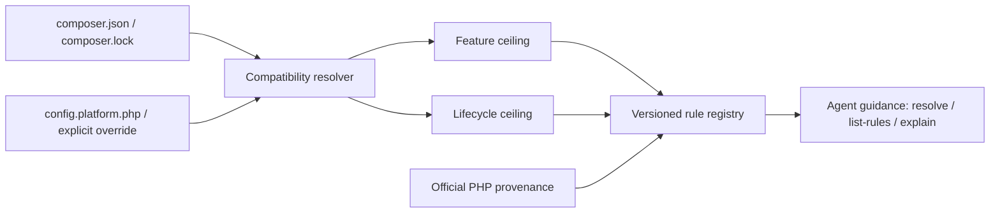

# Modern PHP Guidelines

[](https://github.com/trionnemesis/php-modern-guidelines/actions/workflows/ci.yml)
[](https://github.com/trionnemesis/php-modern-guidelines/actions/workflows/pages.yml)
[](https://www.php.net/)
[](LICENSE)
[](CHANGELOG.md)

> Help AI coding agents write version-aware modern PHP without silently exceeding a project's declared compatibility range.

**M1 / alpha · v0.1.0.** [Open GitHub Pages](https://trionnemesis.github.io/php-modern-guidelines/) · [Roadmap](#roadmap) · [Architecture decisions](docs/adr/) · [Changelog](CHANGELOG.md)

Modern PHP Guidelines is an independent, read-only PHP version-aware policy and rule-query CLI. It resolves a project's declared Composer PHP compatibility range with Composer Semver, splits that range into a feature ceiling and a lifecycle ceiling, and lets a coding agent query a source-backed rule catalogue against that policy through three commands: `resolve`, `list-rules`, and `explain`.

## Why

AI coding agents can produce PHP that is syntactically valid on the developer's current runtime but incompatible with the project's declared minimum version, or keep generating APIs and idioms that newer PHP releases have deprecated or replaced.

A Composer PHP requirement is also a **range**, not necessarily one runtime. This project therefore keeps two policy axes separate:

| Axis | Meaning | Use |
| --- | --- | --- |
| **Feature ceiling** | Lowest PHP minor that must remain supported | Prevent generated syntax or APIs from requiring a newer PHP version. |
| **Lifecycle ceiling** | Highest known PHP minor still inside the supported range | Surface deprecations and removals that matter on newer allowed runtimes. |

For example, `resolve` on a project declaring `require.php: ^8.2` reports `feature_ceiling: 8.2` and `lifecycle_ceiling: 8.5` (the highest minor this tool knows), with `coverage.status: coverage_gap` and `coverage.open_upper_bound: true` — the constraint allows PHP minors above 8.5 that this tool has no lifecycle knowledge of, so it says so instead of guessing. See [ADR-004](docs/adr/ADR-004-two-axis-policy.md).

## Current capability

| Slice | Available in M1 | Boundary |
| --- | --- | --- |
| Policy resolver | Composer Semver range resolution from `require.php`, `conflict.php`, `config.platform.php`, `composer.lock` platform overrides, and `--php`; three modes | Reads two files; never executes the project. |
| Two-axis policy | Separate `feature_ceiling` and `lifecycle_ceiling`, `coverage`/`confidence`/`warnings` | Coverage is limited to PHP 8.2–8.5. |
| Rule registry | Schema-validated, deterministically ordered, 16 source-backed PHP 8.2–8.5 rules | PHP language/Core/bundled-extension only. |
| Query commands | `resolve`, `list-rules`, `explain`, human + JSON | `resolve --json` is a `policy.schema.json` instance. |
| CLI foundation | `version` | unchanged from M0. |
| Verification | PHPUnit, PHPStan level max, PHP-CS-Fixer, PHP 8.2–8.5 CI | Verifies this repository, not a target project. |

### Not implemented yet

- `doctor` — deferred to M2. `resolve` already reports every input the core is permitted to read (`sources[]`), everything it could not establish (`confidence`, `coverage`, `warnings[]`), and distinguishable failure modes (exit codes 2 and 4); a separate command would duplicate that contract without adding information, and the diagnostics it could add beyond that — inspecting the target's installed platform or running Composer — are forbidden by [ADR-006](docs/adr/ADR-006-read-only-core.md).
- Project-local configuration files (`project.config` is reserved in `policy.schema.json` but no such file is read in M1).
- Framework rule packs such as Laravel or Symfony.
- PHPCompatibility, PHPStan-deprecation, or Rector target-project adapters.
- Auto-fixing, target-project writes, PHAR packaging, agent/marketplace manifests, or network-based rule fetching.

`composer.json` `conflict.php` **is** implemented: a known PHP minor is removed from the allowed range only when the conflict constraint covers that minor's whole interval (a patch-level conflict such as `8.3.5` removes nothing). An explicit override — `--php`, `config.platform.php`, a `composer.lock` platform override, or `runtime-observed` mode — bypasses `conflict.php` entirely, the same way it bypasses `require.php`. Because `policy.schema.json`'s `source.type` enum has no value for conflict evidence, an applied conflict is reported through the `policy.conflict_php_applied` warning instead of `sources[]`.

## Policy flow

The architecture is deliberately small and deterministic:



## Quick start

Requires PHP 8.2+ and Composer.

```bash
git clone https://github.com/trionnemesis/php-modern-guidelines.git
cd php-modern-guidelines
composer install
php bin/php-modern-guidelines version
```

Expected output:

```text
php-modern-guidelines 0.1.0
```

Resolve a project's PHP compatibility policy, query the rule catalogue, and explain one rule:

```bash
php bin/php-modern-guidelines resolve --project-root=/path/to/app
php bin/php-modern-guidelines resolve --project-root=/path/to/app --json
php bin/php-modern-guidelines list-rules --project-root=/path/to/app --kind=deprecated
php bin/php-modern-guidelines explain language.property_hooks --project-root=/path/to/app
```

`resolve` on a project declaring `require.php: ^8.2` (real output, `composer.json` at `<app>`):

```text
PHP policy
  mode                 range-safe
  project root         <app>
  declared constraint  ^8.2
  allowed minors       8.2, 8.3, 8.4, 8.5
  feature ceiling      8.2
  lifecycle ceiling    8.5
  platform override    -
  observed runtime     -
  coverage             coverage_gap (known 8.2-8.5, open upper bound)
  confidence           declared

Sources
  composer.require.php  composer.json  ^8.2

Warnings
  coverage.open_upper_bound_bounded: The constraint "^8.2" allows PHP minors newer than 8.5, which this tool does not know. Lifecycle guidance stops at 8.5.
```

Run repository checks with:

```bash
composer check
```

## Exit codes

| Code | Meaning |
| --- | --- |
| `0` | Success. |
| `1` | Unexpected internal error (a bug, not a user-input problem). |
| `2` | Invalid input — malformed/unreadable `composer.json` or `composer.lock`, an unparseable Composer constraint, an unknown `--mode`/`--kind`/`--category`/`--priority`/`--status` value, or an out-of-range `--minor`. |
| `3` | `explain` was given a rule id that does not exist in the loaded rule set. |
| `4` | The effective PHP constraint allows no PHP minor this tool knows about; no policy can be resolved. |
| `5` | Invalid rule data — a malformed, duplicate-id, or filename-mismatched rule file (only reachable with `--rules-dir` pointed at broken data; the bundled catalogue always validates). |

On any non-zero exit, human output goes to stderr and, in `--json` mode, stdout stays byte-empty — a JSON consumer never has to parse a half-written object.

## Known PHP coverage

This tool knows PHP 8.2 through 8.5. A project's declared range can extend beyond that window in either direction, and the two directions are handled differently because their risk is different.

**Below the floor.** If a project's constraint allows a PHP minor below 8.2 (for example `>=8.0`), the tool has no knowledge of 8.0 or 8.1 and clamps `feature_ceiling` to 8.2 anyway, emitting `coverage.status: coverage_gap` with the `coverage.below_known_min` warning. This direction is **unsafe to trust blindly**: the project still supports 8.0 and 8.1, but the published `feature_ceiling` of 8.2 does not guarantee those minors, so a coding agent that trusts the ceiling as-is may emit 8.2-only syntax the project's real minimum cannot run. `policy.schema.json` requires `allowed_minors` to be a non-empty list of minors this tool actually knows, so there is no schema-representable way to also say "and two minors I know nothing about" — inventing them would be guessing. If this warning appears, pass `--php 8.0` to make the intent explicit (the policy then fails closed with exit 4 rather than silently clamping), and treat the warning as a signal to widen this tool's known minors, not to trust the ceiling as published.

**Above the ceiling.** If a project's constraint allows PHP minors above 8.5 — a bounded range like `^8.2` (which desugars to `>=8.2 <9.0` and will admit future 8.x minors) or a genuinely open-ended one like `>=8.2` — `coverage.open_upper_bound` is `true` and the tool emits `coverage.open_upper_bound_bounded` or `coverage.open_upper_bound_unbounded` respectively. This direction is safe: nothing generated is unsafe to run, lifecycle guidance simply stops at 8.5, so deprecations or removals introduced in a later minor are not covered yet.

Both directions are always warned, never invented.

### Rule model

Rules are split into three categories by D13: parser-level syntax is `language`, runtime-visible functions/classes/attributes/constants and engine behavior are `core`, and anything requiring a named, non-default-bundled extension is `extension`. On `modern_preference` and `behavior_change` rules, `introduced_in` is deliberately overloaded: it names "the minor the preferred API arrived in" or "the minor the behavior changed in", not a claim about when PHP introduced the older idiom the rule replaces — this is what lets those rules be gated on the feature axis at all, and each such rule's `details` says so for its own `introduced_in` value. `affected_minors` in an applicability result means *the allowed minors this rule's guidance applies to*, not the minor the underlying lifecycle event fired in — a `deprecated_across_range` rule's `affected_minors` is the whole allowed range, while a `deprecated_in_range` rule lists only the allowed minors at or after the deprecation (under `^8.2`, `extension.curl_close` lists just `8.5`).

`list-rules` is the command that fulfils the issue's `list` slot; it is not named `list` because Symfony Console reserves that name for its own built-in command index. `list-rules` is registered with the alias `rules`, and Symfony's own `list` command is untouched.

By default `list-rules` hides rules whose status is `not_in_range` (rules that cannot apply anywhere in the allowed range); pass `--all` to include them — under `--mode=single-target` at PHP 8.2 that is the difference between `Rules: 9 of 16 shown` and `16 of 16`. Results can be narrowed with repeatable `--kind`, `--category`, `--priority`, and `--status` filters, plus `--extension` and `--minor`; `-r` and `-m` are shorthands for `--project-root` and `--mode` on all three commands.

### `single-target` and the two-axis guarantee

The two-axis separation — feature ceiling independent from lifecycle ceiling — is a **`range-safe` guarantee**, and `range-safe` is the default mode precisely so a caller gets that separation unless they ask otherwise. `--mode=single-target` is a **caller-requested collapse** to one PHP minor: `policy.schema.json` itself caps `allowed_minors` at one item for that mode, and with exactly one allowed minor the lowest and the highest are the same value, so `feature_ceiling` and `lifecycle_ceiling` are equal — there is nothing left to separate. This is announced in the output by `mode` itself and by the `mode.single_target_narrowed` warning, which also states that lifecycle guidance is narrowed to that one minor. It is not an ADR-004 violation: ADR-004's independent-ceilings guarantee describes the default `range-safe` behavior, and `single-target` is an explicit, visible opt-out of it.

### Rule JSON stability

`explain --json`'s `rule` object round-trips: decoding it, rebuilding a `Rule` through `Rule::fromArray()`, and re-encoding it produces **equal** JSON — the same keys in the same order with the same values, byte-identical when re-encoded with the same canonical encoder. (The claim is about equal values / identical JSON bytes, not PHP object identity: `Rule::toArray()` mints a fresh `stdClass` for `package_constraints` on every call, so `===`/`assertSame()` on two `toArray()` calls is `false` even for the same rule — the round-trip is verified with `assertEquals()` or by comparing `JsonPrinter::encode(...)` strings.)

## Trust boundary

The core is designed to advise rather than execute a target project. Core commands are deterministic and read-only unless a later ADR explicitly changes the contract.

They must not:

- execute target-project PHP;
- load the analyzed project's `vendor/autoload.php`;
- run Composer scripts or plugins;
- require network access for core resolution;
- write to the analyzed repository.

See [ADR-006](docs/adr/ADR-006-read-only-core.md).

## Source provenance

PHP language, Core, and bundled-extension facts must be backed by authoritative PHP sources such as official migration guides, PHP RFCs, or php-src upgrading documentation and must record a review date. If a fact cannot be established, the rule should remain absent or explicitly uncertain rather than guessed.

## Roadmap

| Milestone | Version target | Focus | Handoff boundary |
| --- | --- | --- | --- |
| **M0 Foundation** | `v0.0.1` | Repository contracts, CLI skeleton, schemas, CI, static Pages site | Complete. Do not retrofit M1 behavior into the foundation contracts without review. |
| **M1 Core parity** | `v0.1.0` | Composer Semver resolver, two-axis policy, rule registry, `resolve` / `list-rules` / `explain`, verified seed PHP rules | Complete. Keep framework packs and target analyzers out. |
| **M2 Agent distribution** | `v0.2.0` | Agent Skill, PHAR packaging direction, Codex/Claude-compatible wrappers | Next implementation phase. Depends on the now-stable M1 CLI/JSON contracts. |
| **M3 Verification adapters** | `v0.3.0` | Explicit opt-in PHPCompatibility, PHPStan-deprecation, and Rector advisory integration | Must remain advisory/read-only by default. |
| **M4 Framework packs** | `v0.4.x` | Isolated framework-specific guidance, starting with a separately reviewable pack | Must not contaminate PHP Core rules. |

## Repository anatomy

| Path | Purpose |
| --- | --- |
| `src/` | Symfony Console application, the Composer/PHP policy resolver, and the rule registry/query engine. |
| `resources/rules/` | The 16 source-backed seed rule JSON files, one file per rule. |
| `schemas/` | Versioned rule and policy contracts. |
| `docs/adr/` | Binding architecture decisions and trust boundaries. |
| `tests/` | CLI, schema, and static-page verification. |
| `site/` | Dependency-free GitHub Pages overview. |
| `.github/workflows/` | CI and Pages publication workflows. |

## Inspiration and attribution

Primary reference project: [JetBrains/go-modern-guidelines](https://github.com/JetBrains/go-modern-guidelines).

Modern PHP Guidelines is an **independent implementation** inspired by that project's version-aware guidance model. The upstream repository is Apache-2.0 licensed ([upstream license](https://github.com/JetBrains/go-modern-guidelines/blob/main/LICENSE)). No upstream source files were copied into this repository.

JetBrains and GoLand are trademarks of their respective owners. This project is not affiliated with or endorsed by JetBrains.

This project also intentionally stays narrower than [netresearch/php-modernization-skill](https://github.com/netresearch/php-modernization-skill): the planned core is a version-aware PHP policy and rule-query engine rather than a broad modernization orchestrator, framework convention guide, analyzer suite, or automatic fixer.

## Contributing and security

Read [CONTRIBUTING.md](CONTRIBUTING.md) before proposing changes, especially the source-provenance and milestone-boundary rules. Report vulnerabilities through [SECURITY.md](SECURITY.md).
