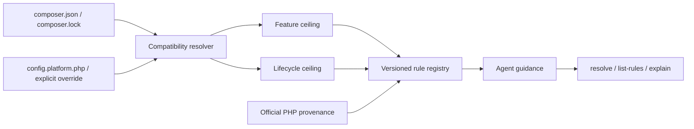

# Modern PHP Guidelines｜PHP 現代化規範

[](https://github.com/trionnemesis/php-modern-guidelines/actions/workflows/ci.yml)
[](https://github.com/trionnemesis/php-modern-guidelines/actions/workflows/pages.yml)
[](https://www.php.net/)
[](LICENSE)
[](CHANGELOG.md)

> 讓 AI coding agent 在產生 PHP 程式碼前，先理解專案真正允許的 PHP 版本範圍、已棄用 API 與現代替代方案，避免「本機可跑、專案最低版本卻不能跑」。

🌐 **[GitHub Pages 專案總覽](https://trionnemesis.github.io/php-modern-guidelines/)** ・ **English version: [README.md](README.md)** ・ [快速開始](#快速開始) ・ [目前能力](#目前能力) ・ [Policy 流程](#policy-流程) ・ [信任邊界](#信任邊界) ・ [Roadmap](#roadmap) ・ [Changelog](CHANGELOG.md)

**M1 / alpha · v0.1.0.** Modern PHP Guidelines 是一個獨立、read-only、version-aware 的 PHP policy 與 rule-query CLI。它使用 Composer Semver 解析目標專案宣告的 PHP 相容範圍，將「可以使用多新的語法/API」與「需要注意多新的 deprecation/removal」拆成兩條獨立軸線，再讓 AI agent 透過 `resolve`、`list-rules`、`explain` 查詢有來源依據的 PHP 規則。

## Why

AI coding agent 很容易依照目前執行環境生成「最新 PHP 寫法」，但真正的專案常同時支援多個 PHP minor。若專案宣告 `require.php: ^8.2`，單純看到開發機是 PHP 8.5 並不足以證明可以使用 PHP 8.5-only 語法。

本專案因此把 Composer PHP range 拆成兩個 policy axis：

| Axis | 代表什麼 | Agent 應如何使用 |
|---|---|---|
| **Feature ceiling** | 必須維持相容的最低 PHP minor | 阻止 agent 產生需要更高 PHP 版本才能執行的語法或 API |
| **Lifecycle ceiling** | 已知且仍落在允許範圍內的最高 PHP minor | 提醒 agent 注意較新 runtime 已出現的 deprecation、removal 或 behavior change |

例如 `require.php: ^8.2` 目前會得到 `feature_ceiling: 8.2`、`lifecycle_ceiling: 8.5`。若 constraint 還允許 PHP 8.5 之後的版本，工具會明確回報 `coverage_gap`，而不是假設未來版本的行為。詳細契約見 [ADR-004](docs/adr/ADR-004-two-axis-policy.md)。

## 目前能力

| Slice | M1 已完成能力 | 關鍵邊界 |
|---|---|---|
| Policy resolver | 解析 `require.php`、`conflict.php`、`config.platform.php`、`composer.lock` platform override 與 `--php` | 只讀取目標專案輸入，不執行目標專案 |
| Two-axis policy | 分離 `feature_ceiling` / `lifecycle_ceiling`，輸出 `coverage`、`confidence`、`warnings` | 已知 PHP coverage 為 8.2–8.5 |
| Rule registry | schema validation、deterministic ordering、16 條 source-backed PHP 8.2–8.5 規則 | 目前只涵蓋 PHP language / Core / bundled extension |
| Agent query surface | `resolve`、`list-rules`、`explain`，支援 human / JSON output | `resolve --json` 必須符合 `policy.schema.json` |
| CLI foundation | `version` 與一致的 exit-code contract | 不寫入目標 repository |
| Verification | PHPUnit、PHPStan level max、PHP-CS-Fixer、PHP 8.2–8.5 CI | 驗證本 repository，不等於掃描目標專案 |

### 尚未實作

- `doctor`：延後到 M2。M1 的 `resolve` 已輸出 core 能讀到的 `sources[]`、無法確定的 `confidence` / `coverage` / `warnings[]` 與可區分的 failure modes。
- Project-local configuration file；`policy.schema.json` 已保留 `project.config` 欄位，但 M1 不讀取此類設定檔。
- Laravel、Symfony 等 framework rule pack。
- PHPCompatibility、PHPStan deprecation、Rector target-project adapter。
- Auto-fix、target-project write、PHAR distribution、agent marketplace manifest、network rule fetching。

`composer.json` 的 `conflict.php` 已支援：只有當 conflict constraint 覆蓋某個已知 PHP minor 的完整區間時，該 minor 才會從允許範圍排除。像 `8.3.5` 這種 patch-level conflict 不會直接移除整個 PHP 8.3。顯式 override（`--php`、`config.platform.php`、`composer.lock` platform override 或 `runtime-observed` mode）則直接決定有效版本，不再套用 `require.php` / `conflict.php` 的 range 推導。

## Policy 流程

整體資料流保持小型、deterministic、read-only：



Agent 的基本判斷順序是：

1. 先用 `resolve` 確認專案實際允許的 PHP policy。
2. 依 `feature_ceiling` 限制可新增的 syntax / API。
3. 依 `lifecycle_ceiling` 找出需要處理的 deprecation / removal / behavior change。
4. 用 `list-rules` 篩選相關規則，再用 `explain` 取得具來源的完整說明。
5. 遇到 coverage gap 或 unknown evidence 時保留警告，不自行補完不存在的 PHP 版本知識。

## 快速開始

需要 PHP 8.2+ 與 Composer。

```bash
git clone https://github.com/trionnemesis/php-modern-guidelines.git
cd php-modern-guidelines
composer install
php bin/php-modern-guidelines version
```

預期輸出：

```text
php-modern-guidelines 0.1.0
```

解析目標專案 policy、列出適用規則、解釋單一規則：

```bash
php bin/php-modern-guidelines resolve --project-root=/path/to/app
php bin/php-modern-guidelines resolve --project-root=/path/to/app --json
php bin/php-modern-guidelines list-rules --project-root=/path/to/app --kind=deprecated
php bin/php-modern-guidelines explain language.property_hooks --project-root=/path/to/app
```

假設目標專案宣告 `require.php: ^8.2`，`resolve` 的代表性輸出如下：

```text
PHP policy
  mode                 range-safe
  project root         <app>
  declared constraint  ^8.2
  allowed minors       8.2, 8.3, 8.4, 8.5
  feature ceiling      8.2
  lifecycle ceiling    8.5
  platform override    -
  observed runtime     -
  coverage             coverage_gap (known 8.2-8.5, open upper bound)
  confidence           declared

Sources
  composer.require.php  composer.json  ^8.2

Warnings
  coverage.open_upper_bound_bounded: The constraint "^8.2" allows PHP minors newer than 8.5, which this tool does not know. Lifecycle guidance stops at 8.5.
```

驗證 repository：

```bash
composer check
```

## CLI 契約

### Exit codes

| Code | 意義 |
|---|---|
| `0` | 成功 |
| `1` | 未預期的內部錯誤；屬於工具本身 bug，而不是使用者輸入問題 |
| `2` | 輸入無效，例如 malformed/unreadable Composer JSON、無法解析的 constraint、未知 option value 或超出已知範圍的 minor |
| `3` | `explain` 指定的 rule id 不存在 |
| `4` | 有效 PHP constraint 沒有任何本工具已知的 PHP minor，因此無法解析 policy |
| `5` | Rule data 無效，例如 malformed rule、duplicate id、filename/id mismatch |

任何非零 exit 下，human output 會寫到 stderr；`--json` mode 的 stdout 保持 byte-empty，避免 JSON consumer 讀到半成品。

### `list-rules`

`list-rules` 對應原始規劃中的 `list` query，但 Symfony Console 已保留 `list` 作為 built-in command index，因此本專案使用 `list-rules`，並提供 `rules` alias。

預設會隱藏 `not_in_range` 規則；使用 `--all` 可查看全部規則。可重複使用 `--kind`、`--category`、`--priority`、`--status`，並搭配 `--extension`、`--minor` 篩選。`-r` 與 `-m` 分別是 `--project-root`、`--mode` 的 shorthand。

## PHP coverage 與 fail-safe 行為

目前已知 PHP minor 為 **8.2–8.5**。若專案 constraint 超出此窗口，工具不會虛構不存在的知識。

| 情境 | 行為 | 風險解讀 |
|---|---|---|
| Constraint 允許低於 PHP 8.2 | `feature_ceiling` 只能 clamp 到已知最低 8.2，並回報 `coverage_gap` / `coverage.below_known_min` | 不可盲目信任；真實專案仍可能需要支援 8.0 / 8.1 |
| Constraint 允許高於 PHP 8.5 | 回報 `coverage.open_upper_bound` 與對應 warning | 既有 generated code 不因此變得不安全，但 8.5 之後的新 deprecation/removal 尚未被涵蓋 |
| Explicit `--php` 指向未知 minor | fail closed，exit `4` | 不把未知 runtime 假裝成已支援 |

低於 coverage floor 的方向尤其需要注意：如果真實專案仍支援 8.0 / 8.1，本工具目前不能證明 PHP 8.2-only feature 對它安全。這類 warning 應視為擴充 rule/coverage 的訊號，而不是忽略訊號。

## Rule model

Rule 分成三類：

| Category | 範圍 |
|---|---|
| `language` | parser-level syntax |
| `core` | runtime-visible function / class / attribute / constant 與 engine behavior |
| `extension` | 需要具名、非 default-bundled extension 的行為 |

`modern_preference` 與 `behavior_change` 的 `introduced_in` 表示「偏好 API 出現的版本」或「行為改變的版本」，不是舊寫法最初被 PHP 引入的版本。`affected_minors` 表示這條 guidance 在目前 policy 允許的哪些 minor 上成立，而不是單純重複 lifecycle event 發生的版本。

### `single-target` mode

Two-axis 分離是預設 `range-safe` mode 的保證。`--mode=single-target` 是 caller 主動把範圍縮到單一 PHP minor；此時 allowed minor 只有一個，因此 `feature_ceiling` 與 `lifecycle_ceiling` 會相同，並透過 `mode.single_target_narrowed` warning 明確揭露這個收斂行為。

### Rule JSON stability

`explain --json` 的 `rule` object 支援 deterministic round-trip：使用相同 canonical encoder 解碼、重建 `Rule`、再編碼後，JSON value 與輸出 bytes 保持一致。這項保證是資料契約一致性，不是 PHP object identity 保證。

## 信任邊界

Core 的定位是「提供可驗證建議」，不是「執行或修改目標專案」。除非未來 ADR 明確改變契約，core commands 都必須保持 deterministic 與 read-only。

不得：

- 執行 target-project PHP；
- 載入 target project 的 `vendor/autoload.php`；
- 執行 Composer scripts 或 plugins；
- 為 core resolution 要求 network access；
- 寫入被分析的 repository。

完整設計見 [ADR-006](docs/adr/ADR-006-read-only-core.md)。

## Source provenance

PHP language、Core 與 bundled-extension 的 lifecycle facts 必須有 authoritative PHP source，例如：

- PHP 官方 migration guide；
- PHP RFC；
- php-src `UPGRADING` documentation。

每條規則同時保存 review date。若事實無法建立，規則應保持 absent 或明確標記 uncertainty，不以推測補齊。

## Roadmap

| Milestone | Version | 狀態 / Focus | Handoff boundary |
|---|---|---|---|
| **M0 Foundation** | `v0.0.1` | ✅ 完成：repository contracts、CLI skeleton、schemas、CI、static Pages | Foundation contract 已建立 |
| **M1 Core parity** | `v0.1.0` | ✅ 完成：Composer Semver resolver、two-axis policy、rule registry、`resolve` / `list-rules` / `explain`、16 條 seed rules | Framework pack 與 target analyzer 不進入 M1 |
| **M2 Agent distribution** | `v0.2.0` | 下一階段：Agent Skill、PHAR packaging direction、Codex / Claude-compatible wrapper | 依賴穩定的 M1 CLI / JSON contract |
| **M3 Verification adapters** | `v0.3.0` | 規劃：PHPCompatibility、PHPStan-deprecation、Rector advisory integration | 預設保持 advisory / read-only |
| **M4 Framework packs** | `v0.4.x` | 規劃：獨立 framework-specific guidance，優先從可單獨 review 的 pack 開始 | 不污染 PHP Core rule set |

## Repository 結構

| Path | 用途 |
|---|---|
| `src/` | Symfony Console application、Composer/PHP policy resolver、rule registry/query engine |
| `resources/rules/` | 16 個 source-backed seed rule JSON，一條 rule 一個檔案 |
| `schemas/` | Versioned rule / policy contracts |
| `docs/adr/` | Binding architecture decisions 與 trust boundaries |
| `tests/` | CLI、schema、static-page verification |
| `site/` | Dependency-free GitHub Pages overview |
| `.github/workflows/` | CI、Pages 與 release workflow |

## Inspiration and attribution

主要參考專案：[JetBrains/go-modern-guidelines](https://github.com/JetBrains/go-modern-guidelines)。

Modern PHP Guidelines 是受其 version-aware guidance model 啟發的**獨立實作**。上游 repository 採 Apache-2.0 license（[upstream license](https://github.com/JetBrains/go-modern-guidelines/blob/main/LICENSE)）；本 repository 沒有複製上游 source files。

JetBrains 與 GoLand 為其各自權利人的商標。本專案與 JetBrains 無隸屬、合作或背書關係。

本專案也刻意維持比 [netresearch/php-modernization-skill](https://github.com/netresearch/php-modernization-skill) 更窄的產品邊界：核心是 version-aware PHP policy / rule-query engine，而不是廣泛的 modernization orchestrator、framework convention guide、analyzer suite 或 automatic fixer。

## Contributing and security

提交變更前請先閱讀 [CONTRIBUTING.md](CONTRIBUTING.md)，特別是 source provenance 與 milestone boundary 規則。安全性問題請依 [SECURITY.md](SECURITY.md) 回報。
