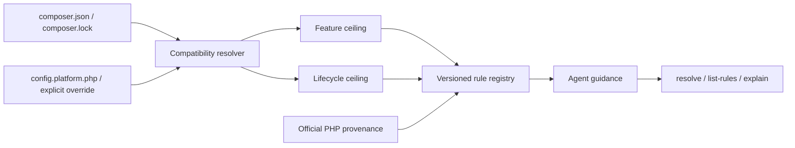

# Modern PHP Guidelines｜PHP 現代化規範

[](https://github.com/trionnemesis/php-modern-guidelines/actions/workflows/ci.yml)
[](https://github.com/trionnemesis/php-modern-guidelines/actions/workflows/pages.yml)
[](https://www.php.net/)
[](LICENSE)
[](CHANGELOG.md)
[](docs/adr/ADR-008-external-verification-adapters.md)

> 讓 AI coding agent 在產生 PHP 程式碼前，先理解專案真正允許的 PHP 版本範圍、已棄用 API 與現代替代方案，避免「本機可跑、專案最低版本卻不能跑」。

🌐 **[GitHub Pages 專案總覽](https://trionnemesis.github.io/php-modern-guidelines/)** ・ **English version: [README.md](README.md)** ・ [快速開始](#快速開始) ・ [目前能力](#目前能力) ・ [Agent distribution](#agent-distribution) ・ [Policy 流程](#policy-流程) ・ [信任邊界](#信任邊界) ・ [Roadmap](#roadmap) ・ [Changelog](CHANGELOG.md)

**已發布：M2 / alpha · v0.2.0。** Modern PHP Guidelines 是一個獨立、read-only、version-aware 的 PHP policy 與 rule-query CLI。它使用 Composer Semver 解析目標專案宣告的 PHP 相容範圍，將「可以使用多新的語法/API」與「需要注意多新的 deprecation/removal」拆成兩條獨立軸線，再讓 AI agent 透過 `resolve`、`list-rules`、`explain`、`doctor` 查詢有來源依據的 PHP 規則。現在也提供 Claude Agent Skill、Codex 相容的 `AGENTS.md` snippet，以及 CI 建置、checksum 驗證的 PHAR release asset。

> **開發狀態：** `v0.2.0` 仍是最新正式 release。Current source tree 另外包含尚未發布的 M3-A verification foundation：canonical report contract 與 `verify <adapter> --executable=<path-or-name>`。Production registry 目前只有不執行程式的 `phpcompatibility` unavailable placeholder；M3-A 不會執行 PHPCompatibility、PHPStan、Rector 或其他真實 analyzer。

## Why

AI coding agent 很容易依照目前執行環境生成「最新 PHP 寫法」，但真正的專案常同時支援多個 PHP minor。若專案宣告 `require.php: ^8.2`，單純看到開發機是 PHP 8.5 並不足以證明可以使用 PHP 8.5-only 語法。

本專案因此把 Composer PHP range 拆成兩個 policy axis：

| Axis | 代表什麼 | Agent 應如何使用 |
|---|---|---|
| **Feature ceiling** | 必須維持相容的最低 PHP minor | 阻止 agent 產生需要更高 PHP 版本才能執行的語法或 API |
| **Lifecycle ceiling** | 已知且仍落在允許範圍內的最高 PHP minor | 提醒 agent 注意較新 runtime 已出現的 deprecation、removal 或 behavior change |

例如 `require.php: ^8.2` 目前會得到 `feature_ceiling: 8.2`、`lifecycle_ceiling: 8.5`。若 constraint 還允許 PHP 8.5 之後的版本，工具會明確回報 `coverage_gap`，而不是假設未來版本的行為。詳細契約見 [ADR-004](docs/adr/ADR-004-two-axis-policy.md)。

## 目前能力

| Slice | 已完成能力 | 關鍵邊界 |
|---|---|---|
| Policy resolver | 解析 `require.php`、`conflict.php`、`config.platform.php`、`composer.lock` platform override 與 `--php` | 只讀取目標專案輸入，不執行目標專案 |
| Two-axis policy | 分離 `feature_ceiling` / `lifecycle_ceiling`，輸出 `coverage`、`confidence`、`warnings` | 已知 PHP coverage 為 8.2–8.5 |
| Rule registry | schema validation、deterministic ordering、16 條 source-backed PHP 8.2–8.5 規則 | 目前只涵蓋 PHP language / Core / bundled extension |
| Agent query surface | `resolve`、`list-rules`、`explain`，支援 human / JSON output | `resolve --json` 必須符合 `policy.schema.json` |
| CLI foundation | `version` 與一致的 exit-code contract | 不寫入目標 repository |
| Repository verification | PHPUnit、PHPStan level max、PHP-CS-Fixer、PHP 8.2–8.5 CI | 驗證本 repository，不等於掃描目標專案 |
| Verification foundation | 尚未發布的 M3-A `verify` command、canonical JSON schema、deterministic statuses、exact-mapping model 與 test-only fake adapter | Production 只辨識 truthful unavailable placeholder；不執行真實 analyzer |
| Agent distribution | `skills/php-modern-guidelines/` 下的 Claude Agent Skill，以及 `skills/agents-md/` 下 Codex 相容的 `AGENTS.md` snippet | 僅提供指令文字；沒有 marketplace 或 plugin manifest，也沒有 agent-runtime 註冊 |
| PHAR distribution | 由 CI 建置並 smoke-test 的單一檔案封存，每次 release 附上 SHA-256 checksum | 只在 CI 建置；build tool 不是 Composer dependency |
| Diagnostics | `doctor` 以 human 與 JSON 形式回報本工具實際讀到、載入的內容 | 診斷本工具自身的輸入與安裝狀態；不檢查或執行目標專案 |

### 尚未實作

- Project-local configuration file；`policy.schema.json` 已保留 `project.config` 欄位，但 M2 不讀取此類設定檔。
- Laravel、Symfony 等 framework rule pack。
- 真實 PHPCompatibility、PHPStan deprecation、Rector target-project adapter；M3-A 只有不執行程式的 PHPCompatibility placeholder。
- Auto-fix、target-project write、agent marketplace manifest、network rule fetching。

`composer.json` 的 `conflict.php` 已支援：只有當 conflict constraint 覆蓋某個已知 PHP minor 的完整區間時，該 minor 才會從允許範圍排除。像 `8.3.5` 這種 patch-level conflict 不會直接移除整個 PHP 8.3。顯式 override（`--php`、`config.platform.php`、`composer.lock` platform override 或 `runtime-observed` mode）則直接決定有效版本，不再套用 `require.php` / `conflict.php` 的 range 推導。

## Agent distribution

M2 讓 M1 engine 可以被沒有 vendor 這個 repository 的 coding agent 使用：一個可散布的 Claude Agent Skill、給 Codex 相容 agent 使用的純 Markdown `AGENTS.md` wrapper，以及每次 release 都附上的 CI-built PHAR。

個人安裝 skill：

```bash
mkdir -p ~/.claude/skills
cp -R skills/php-modern-guidelines ~/.claude/skills/
```

或安裝進消費端專案：

```bash
mkdir -p .claude/skills
cp -R skills/php-modern-guidelines .claude/skills/
```

若 agent 是透過慣例讀取 `AGENTS.md` 而非 skill 機制，把 [`skills/agents-md/SNIPPET.md`](skills/agents-md/SNIPPET.md) 裡的區塊貼進消費端專案自己的 `AGENTS.md`。

安裝 release 出來的 PHAR 前，先驗證它：

```bash
curl -fsSL -o php-modern-guidelines.phar \
  https://github.com/trionnemesis/php-modern-guidelines/releases/latest/download/php-modern-guidelines.phar
curl -fsSL -o php-modern-guidelines.phar.sha256 \
  https://github.com/trionnemesis/php-modern-guidelines/releases/latest/download/php-modern-guidelines.phar.sha256
sha256sum -c php-modern-guidelines.phar.sha256
php php-modern-guidelines.phar version
```

這個 package 目前還沒有發布到 Packagist，因此沒有 `composer require` 安裝路徑；下方 [快速開始](#快速開始) 的 git checkout 與這個 PHAR 是目前兩個受支援的安裝方式。

Skill 與 `AGENTS.md` 文字是針對真實 CLI 做 contract-tested，而不是靠 review：文字中提到的每個 command、option、exit code 與 rule id 都必須存在於真實 CLI，每個示範也都會被實際執行並逐位元組比對輸出，所以這些說明不會偷偷跟工具本身脫節。

PHAR 是在 PHP 8.2 floor 上由 CI 建置並 smoke-test，並附上 SHA-256 checksum 發布；「reproducible」精確代表什麼、不代表什麼，見 [ADR-007](docs/adr/ADR-007-phar-build-and-distribution.md)——它不是 byte-identical 封存或跨 build 固定 dependency 版本的保證。

## Policy 流程

整體資料流保持小型、deterministic、read-only：



Agent 的基本判斷順序是：

1. 先用 `resolve` 確認專案實際允許的 PHP policy。
2. 依 `feature_ceiling` 限制可新增的 syntax / API。
3. 依 `lifecycle_ceiling` 找出需要處理的 deprecation / removal / behavior change。
4. 用 `list-rules` 篩選相關規則，再用 `explain` 取得具來源的完整說明。
5. 遇到 coverage gap 或 unknown evidence 時保留警告，不自行補完不存在的 PHP 版本知識。

## 快速開始

需要 PHP 8.2+ 與 Composer。

```bash
git clone https://github.com/trionnemesis/php-modern-guidelines.git
cd php-modern-guidelines
composer install
php bin/php-modern-guidelines version
```

預期輸出：

```text
php-modern-guidelines 0.2.0
```

解析目標專案 policy、列出適用規則、解釋單一規則，並診斷本工具自身的輸入：

```bash
php bin/php-modern-guidelines resolve --project-root=/path/to/app
php bin/php-modern-guidelines resolve --project-root=/path/to/app --json
php bin/php-modern-guidelines list-rules --project-root=/path/to/app --kind=deprecated
php bin/php-modern-guidelines explain language.property_hooks --project-root=/path/to/app
php bin/php-modern-guidelines doctor --project-root=/path/to/app
```

### 尚未發布的 M3-A verification foundation

只有包含 M3-A 的 source checkout 具備新的 verification contract；正式發布的 `v0.2.0` PHAR
沒有此功能。Explicit command shape 為：

```bash
php bin/php-modern-guidelines verify phpcompatibility \
  --executable=/path/to/phpcs \
  --project-root=/path/to/app \
  --json
```

M3-A 不會啟動該 executable。若找不到 executable，`verify` 會以 exit `7` 回傳完整 unavailable
report；若 executable 存在，同一 exit 會說明此 build 尚未實作 adapter capability。兩者都不
代表已驗證 target code。只有在後續 M3 slice 完成並驗證 exact policy projection 與
zero-mutation guarantee 後，才會開始執行真實 analyzer。

假設目標專案宣告 `require.php: ^8.2`，`resolve` 的代表性輸出如下：

```text
PHP policy
  mode                 range-safe
  project root         <app>
  declared constraint  ^8.2
  allowed minors       8.2, 8.3, 8.4, 8.5
  feature ceiling      8.2
  lifecycle ceiling    8.5
  platform override    -
  observed runtime     -
  coverage             coverage_gap (known 8.2-8.5, open upper bound)
  confidence           declared

Sources
  composer.require.php  composer.json  ^8.2

Warnings
  coverage.open_upper_bound_bounded: The constraint "^8.2" allows PHP minors newer than 8.5, which this tool does not know. Lifecycle guidance stops at 8.5.
```

驗證 repository：

```bash
composer check
```

## CLI 契約

### Exit codes

| Code | 意義 |
|---|---|
| `0` | 成功 |
| `1` | 未預期的內部錯誤；屬於工具本身 bug，而不是使用者輸入問題 |
| `2` | 輸入無效，例如 malformed/unreadable Composer JSON、無法解析的 constraint、未知 option value 或超出已知範圍的 minor |
| `3` | `explain` 指定的 rule id 不存在 |
| `4` | 有效 PHP constraint 沒有任何本工具已知的 PHP minor，因此無法解析 policy |
| `5` | Rule data 無效，例如 malformed rule、duplicate id、filename/id mismatch |
| `6` | Verification 已完成，並產生一筆以上 advisory finding |
| `7` | 選定的 verification adapter 或 executable 不可用 |
| `8` | Verification adapter 無法完成執行 |
| `9` | Resolved PHP policy 無法精確投影到選定 analyzer |

`resolve`、`list-rules`、`explain` 任何非零 exit 下，human output 會寫到 stderr，`--json` mode 的 stdout 保持 byte-empty，避免 JSON consumer 讀到半成品。`doctor` 是唯一有記載的例外：它的報告本身就是診斷結果，所以即使 exit 非零，也會把完整報告寫到 stdout、stderr 保持空白——唯一的例外是 `doctor` 自身 option 的呼叫錯誤，這種情況仍然在任何 check 執行前就被拒絕，且 stdout 保持 byte-empty。

`verify` 是另一個會產生完整 report 的 surface。Outcome `0`、`6`、`7`、`8`、`9` 都會將一份
完整 human 或 canonical JSON report 寫到 stdout，stderr 保持 byte-empty。Invalid invocation、
policy、rule-data 與 internal error 維持既有 `2`、`4`、`5`、`1` 的 empty-stdout 語意；JSON
consumer 不會收到 partial verification document。

### `list-rules`

`list-rules` 對應原始規劃中的 `list` query，但 Symfony Console 已保留 `list` 作為 built-in command index，因此本專案使用 `list-rules`，並提供 `rules` alias。

預設會隱藏 `not_in_range` 規則；使用 `--all` 可查看全部規則。可重複使用 `--kind`、`--category`、`--priority`、`--status`，並搭配 `--extension`、`--minor` 篩選。`-r` 與 `-m` 分別是 `--project-root`、`--mode` 的 shorthand。

### `doctor`

`doctor` 對這個工具自身的輸入與安裝狀態，針對目標專案執行九個固定順序的 read-only check：執行中的 build（版本、以及是從 PHAR 還是從原始碼執行）、project root、`composer.json` 與 `composer.lock` 的存在性/可讀性/JSON 有效性、宣告的 PHP 值、resolve 出來的 policy 摘要、兩個 core rule/policy schema，以及有效的 rules 目錄與其載入結果。每個 check 都會回報一個 status（`ok` / `warn` / `fail` / `skipped`）、固定的一行 summary，以及固定的 detail key 集合，human 與 `--json` 兩種形式一一對應；JSON 形式與 `list-rules`、`explain` 一樣帶有 `output_version`。它不會引入新的 exit code——process 的 exit code 就是第一個失敗 check 原本就會產生的 `1` / `2` / `4` / `5`。如上所述，即使 exit 非零，`doctor` 仍會把完整報告寫到 stdout，因為報告本身就是診斷；`doctor` 自身 option 的呼叫錯誤是唯一仍然不印出任何內容的情況。

### `verify`

`verify` 需要一個 adapter argument、四個 shared policy option（`--project-root`、`--php`、
`--mode`、`--json`），以及必要的 `--executable` path 或 `PATH` name。它會先 resolve policy，
再向選定 adapter 取得 evidence。Canonical JSON document 必須符合
[`verification.schema.json`](schemas/verification.schema.json)，並記錄 status、exit code、adapter、
policy fingerprint 與 projection status、預先驗證的 invocation plan、實際嘗試的 invocation、
deterministic counts、reason、
mapped source-backed rule context，以及 mapped/unmapped external finding；不輸出 timestamp。
Plan 會區分不參與 policy partition 的 tool probe 與 policy-partitioned analysis，並記錄固定的
`project_root` working-directory role、bounded timeout 與 sanitized environment role；report evidence
不會洩漏 machine-specific executable path prefix。

這是 explicit adapter boundary，不是 arbitrary-command interface；caller 無法傳入 raw analyzer
arguments。M3-A 只辨識 `phpcompatibility`，且該 registration 是 non-executing placeholder。
Missing 或尚未實作的 capability 會保持 `unavailable`，不會自動安裝、近似處理或宣稱已成功
掃描。完整決策見 [ADR-008](docs/adr/ADR-008-external-verification-adapters.md)。

## PHP coverage 與 fail-safe 行為

目前已知 PHP minor 為 **8.2–8.5**。若專案 constraint 超出此窗口，工具不會虛構不存在的知識。

| 情境 | 行為 | 風險解讀 |
|---|---|---|
| Constraint 允許低於 PHP 8.2 | `feature_ceiling` 只能 clamp 到已知最低 8.2，並回報 `coverage_gap` / `coverage.below_known_min` | 不可盲目信任；真實專案仍可能需要支援 8.0 / 8.1 |
| Constraint 允許高於 PHP 8.5 | 回報 `coverage.open_upper_bound` 與對應 warning | 既有 generated code 不因此變得不安全，但 8.5 之後的新 deprecation/removal 尚未被涵蓋 |
| Explicit `--php` 指向未知 minor | fail closed，exit `4` | 不把未知 runtime 假裝成已支援 |

低於 coverage floor 的方向尤其需要注意：如果真實專案仍支援 8.0 / 8.1，本工具目前不能證明 PHP 8.2-only feature 對它安全。這類 warning 應視為擴充 rule/coverage 的訊號，而不是忽略訊號。

## Rule model

Rule 分成三類：

| Category | 範圍 |
|---|---|
| `language` | parser-level syntax |
| `core` | runtime-visible function / class / attribute / constant 與 engine behavior |
| `extension` | 需要具名、非 default-bundled extension 的行為 |

`modern_preference` 與 `behavior_change` 的 `introduced_in` 表示「偏好 API 出現的版本」或「行為改變的版本」，不是舊寫法最初被 PHP 引入的版本。`affected_minors` 表示這條 guidance 在目前 policy 允許的哪些 minor 上成立，而不是單純重複 lifecycle event 發生的版本。

### `single-target` mode

Two-axis 分離是預設 `range-safe` mode 的保證。`--mode=single-target` 是 caller 主動把範圍縮到單一 PHP minor；此時 allowed minor 只有一個，因此 `feature_ceiling` 與 `lifecycle_ceiling` 會相同，並透過 `mode.single_target_narrowed` warning 明確揭露這個收斂行為。

### Rule JSON stability

`explain --json` 的 `rule` object 支援 deterministic round-trip：使用相同 canonical encoder 解碼、重建 `Rule`、再編碼後，JSON value 與輸出 bytes 保持一致。這項保證是資料契約一致性，不是 PHP object identity 保證。

## 信任邊界

Core 的定位是「提供可驗證建議」，不是「執行或修改目標專案」。除非未來 ADR 明確改變契約，core commands 都必須保持 deterministic 與 read-only。

不得：

- 執行 target-project PHP；
- 載入 target project 的 `vendor/autoload.php`；
- 執行 Composer scripts 或 plugins；
- 為 core resolution 要求 network access；
- 寫入被分析的 repository。

完整設計見 [ADR-006](docs/adr/ADR-006-read-only-core.md)。

尚未發布的 M3-A `verify` 是另一個 explicit boundary，受
[ADR-008](docs/adr/ADR-008-external-verification-adapters.md) 約束。Current production placeholder
只做 read-only executable discovery，不會啟動 analyzer。後續真實 adapter 必須以 isolated child
process 執行、精確使用 resolved policy、禁止 network/configuration/install 行為、保留 unmapped
evidence，並證明 target tree 執行前後 byte-identical；這不會削弱 metadata-only core commands。

## Source provenance

PHP language、Core 與 bundled-extension 的 lifecycle facts 必須有 authoritative PHP source，例如：

- PHP 官方 migration guide；
- PHP RFC；
- php-src `UPGRADING` documentation。

每條規則同時保存 review date。若事實無法建立，規則應保持 absent 或明確標記 uncertainty，不以推測補齊。

## Roadmap

| Milestone | Version | 狀態 / Focus | Handoff boundary |
|---|---|---|---|
| **M0 Foundation** | `v0.0.1` | ✅ 完成：repository contracts、CLI skeleton、schemas、CI、static Pages | Foundation contract 已建立 |
| **M1 Core parity** | `v0.1.0` | ✅ 完成：Composer Semver resolver、two-axis policy、rule registry、`resolve` / `list-rules` / `explain`、16 條 seed rules | Framework pack 與 target analyzer 不進入 M1 |
| **M2 Agent distribution** | `v0.2.0` | ✅ 完成：Agent Skill、Codex/AGENTS.md wrapper、附加在 release 上的 CI-built PHAR，以及 bounded `doctor` | 依賴穩定的 M1 CLI / JSON contract |
| **M3 Verification adapters** | `v0.3.0` | 🚧 M3-A foundation 已在 source 完成但尚未發布；真實 PHPCompatibility、PHPStan-deprecation、Rector advisory adapter 仍屬後續 slice | Explicit opt-in、exact policy projection、advisory evidence、zero target writes |
| **M4 Framework packs** | `v0.4.x` | 規劃：獨立 framework-specific guidance，優先從可單獨 review 的 pack 開始 | 不污染 PHP Core rule set |

## Repository 結構

| Path | 用途 |
|---|---|
| `src/` | Symfony Console application、Composer/PHP policy resolver、rule registry/query engine 與 explicit verification boundary |
| `resources/rules/` | 16 個 source-backed seed rule JSON，一條 rule 一個檔案 |
| `schemas/` | Versioned rule、policy 與尚未發布的 verification contracts |
| `docs/adr/` | Binding architecture decisions 與 trust boundaries |
| `tests/` | CLI、schema、static-page verification |
| `site/` | Dependency-free GitHub Pages overview |
| `.github/workflows/` | CI、Pages 與 release workflow |
| `skills/` | 可散布的 Agent Skill 與 Codex 相容的 `AGENTS.md` snippet |
| `box.json.dist` | 已提交的 PHAR build 設定；build tool 只安裝在 CI 中 |
| `tools/` | 僅供 CI 使用的 build helper script |

## Inspiration and attribution

主要參考專案：[JetBrains/go-modern-guidelines](https://github.com/JetBrains/go-modern-guidelines)。

Modern PHP Guidelines 是受其 version-aware guidance model 啟發的**獨立實作**。上游 repository 採 Apache-2.0 license（[upstream license](https://github.com/JetBrains/go-modern-guidelines/blob/main/LICENSE)）；本 repository 沒有複製上游 source files。

JetBrains 與 GoLand 為其各自權利人的商標。本專案與 JetBrains 無隸屬、合作或背書關係。

本專案也刻意維持比 [netresearch/php-modernization-skill](https://github.com/netresearch/php-modernization-skill) 更窄的產品邊界：核心是 version-aware PHP policy / rule-query engine，而不是廣泛的 modernization orchestrator、framework convention guide、analyzer suite 或 automatic fixer。

## Contributing and security

提交變更前請先閱讀 [CONTRIBUTING.md](CONTRIBUTING.md)，特別是 source provenance 與 milestone boundary 規則。安全性問題請依 [SECURITY.md](SECURITY.md) 回報。
